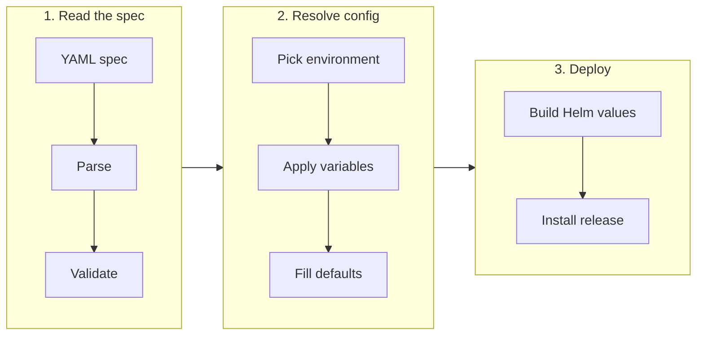

# Deployah

> [!WARNING]
> Deployah is experimental and under active development.

Deployah is a CLI tool that makes deploying apps easy. It uses Helm under the
hood, so you do not need to know Kubernetes or Helm, or even install the `helm`,
`kubectl`, or `kind` tools. It is a single binary.

You write a short **spec**. Deployah turns it into a running **release** on
Kubernetes. We call this **Spec-to-Release**. It is like Source-to-Image (S2I),
but for the deploy step: S2I builds your image, and Deployah runs your release.

## Contents

- [Installation](#installation)
- [Requirements](#requirements)
- [Quick start](#quick-start)
- [How Deployah works](#how-deployah-works)
- [Concepts](#concepts)
- [Writing your spec](#writing-your-spec)
- [Commands](#commands)
- [Environments and variables](#environments-and-variables)
- [Accessing your app](#accessing-your-app)
- [Local cluster networking](#local-cluster-networking)
- [Troubleshooting](#troubleshooting)
- [Schema reference](#schema-reference)
- [Development](#development)

## Installation

### Homebrew

```sh
brew install deployah-dev/tap/deployah
```

### Using Nix (recommended)

If you have [Nix](https://nixos.org/download.html) installed:

```sh
# Run without installing
nix run github:deployah-dev/deployah

# Or add it to your flake.nix
inputs.deployah.url = "github:deployah-dev/deployah";
```

### Install with Go

```sh
go install deployah.dev/deployah@latest
```

## Requirements

Deployah is a single binary. You do **not** need the `helm`, `kubectl`, or `kind`
command-line tools. Deployah includes Helm, the Kubernetes client, and Kind as
libraries, so it talks to your cluster by itself.

- **Deploy to a cluster you already have:** you only need access to it (a
  kubeconfig). No container runtime is required.
- **Use the built-in local cluster** (`deployah cluster up`): you need a
  container runtime, either **Docker** or **Podman**. This is the only extra
  tool, and it is needed only for the local cluster.

## Quick start

This walks you through one full deploy on your own machine. It takes about five
minutes. For the local cluster you need Docker or Podman running (see
[Requirements](#requirements)).

You do not need an existing Kubernetes cluster. Deployah can make a local one
for you.

### 1. Start a local cluster

```sh
deployah cluster up
```

This creates a small local Kubernetes cluster (using Kind) and gives it the
context name `kind-deployah`.

### 2. Create a spec

Save this as `deployah.yaml` in an empty folder. It runs the public `nginx`
image, so you do not need to build anything.

```yaml
apiVersion: v1-alpha.1
project: my-first-app
components:
  web:
    image: nginx:latest
    port: 80
    environments: [local]
    ingress:
      host: my-first-app.local
environments:
  - name: local
    context: kind-deployah
```

### 3. Deploy

```sh
deployah deploy local
```

### 4. See it running

```sh
# Show the status of your project
deployah status my-first-app

# Show the local cluster and the URLs you can open
deployah cluster status
```

`deployah cluster status` prints a ready-to-use URL for your app. Open it in
your browser to see the nginx welcome page.

You can also stream the logs:

```sh
deployah logs my-first-app
```

### 5. Clean up

```sh
# Remove the app
deployah delete my-first-app local

# Stop and delete the local cluster
deployah cluster down
```

## How Deployah works

Deployah turns your `deployah.yaml` spec into a running Kubernetes deployment in
three steps.


```mermaid
flowchart LR
    subgraph phase1["1. Read the spec"]
        direction TB
        A["YAML spec"] --> B["Parse"] --> C["Validate"]
    end
    subgraph phase2["2. Resolve config"]
        direction TB
        D["Pick environment"] --> E["Apply variables"] --> F["Fill defaults"]
    end
    subgraph phase3["3. Deploy"]
        direction TB
        G["Build Helm values"] --> H["Install release"]
    end
    phase1 --> phase2 --> phase3
```

1. **Read the spec.** Deployah reads your `deployah.yaml` and checks it against a
   JSON Schema, so mistakes are caught early with clear messages.
2. **Resolve config.** Deployah picks the environment you asked for, substitutes
   your variables, and fills in sensible defaults.
3. **Deploy.** Deployah builds Helm values from your spec and installs a Helm
   release on your cluster. You never write a Helm chart yourself.

For how Deployah compares to similar tools (DevSpace, Werf, Score, Epinio,
Kubero), see [docs/comparison.md](docs/comparison.md).

## Concepts

A few words you will see often.

- **Project.** One app, with a name. The name prefixes the Kubernetes resources
  Deployah creates. It is the `project` field in your spec.
- **Component.** One deployable part of your project, such as a web service or a
  background worker. A project has one or more components.
- **Role.** What a component is for:
  - `service`: it serves traffic and can be exposed (the default).
  - `worker`: a long-running background task, not exposed.
  - `job`: a one-off task that runs and then stops.
- **Kind.** `stateless` (the default, easy to scale) or `stateful` (needs
  persistent storage).
- **What deploys today.** Deployah currently deploys `stateless` `service`
  components. The `worker` and `job` roles and the `stateful` kind are in the
  schema but are not deployable yet, so a deploy that uses them stops with a
  "not supported yet" error.
- **Environment.** A target such as `dev`, `staging`, or `prod`. Each
  environment can use a different cluster, different files, and different
  variables.
- **Resource preset.** A quick way to set CPU and memory without knowing
  Kubernetes units. Use `resourcePreset: small` instead of writing exact values.
- **Bring your own image.** Deployah does not build images. You give it an image
  that already exists in a registry your cluster can pull from. Build your image
  in CI (or locally), then let Deployah deploy it.

## Writing your spec

Your spec is a file named `deployah.yaml`. It has three required parts:
`apiVersion`, `project`, and `components`. You also define your `environments`.

Here is a full example that shows the common fields. You do not need all of
them; most have defaults.

```yaml
apiVersion: v1-alpha.1            # required: the schema version
project: shop                     # required: your project name

components:                       # required: one or more components
  api:
    image: ghcr.io/acme/shop-api:${TAG}  # tag comes from the environment below
    role: service                 # service | worker | job (default: service)
    kind: stateless               # stateless | stateful (default: stateless)
    port: 8080                    # the port your app listens on (default: 8080)
    environments: [staging, prod] # which environments deploy this component
    command: ["/bin/api"]         # optional: override the image ENTRYPOINT
    args: ["--verbose"]           # optional: override the image CMD
    env:                          # planned: not applied to the container yet
      LOG_LEVEL: info
    resourcePreset: small         # nano|micro|small|medium|large|xlarge|2xlarge
    ingress:                      # optional: expose over HTTP/HTTPS
      host: api.example.com       # required when you use ingress
      tls: false                  # default: false
    autoscaling:                  # optional: scale on CPU or memory
      enabled: true
      minReplicas: 2
      maxReplicas: 5
      metrics:
        - type: cpu               # cpu | memory
          target: 70              # target usage percentage

environments:                     # define your environments
  - name: staging
    context: kind-deployah        # the kube context to deploy to
    variables:
      TAG: 1.4.0-rc               # fills ${TAG} in the image above
  - name: prod
    context: prod-cluster
    variables:
      TAG: 1.4.0                  # fills ${TAG} in the image above
```

Use either `resourcePreset` or `resources`, not both. Presets are the easy
option; `resources` lets you set exact CPU, memory, and ephemeral storage.

### Field reference

Top level:

| Field | Required | Notes |
|---|---|---|
| `apiVersion` | Yes | The schema version, for example `v1-alpha.1`. |
| `project` | Yes | Lowercase name (DNS-1123). Prefixes your Kubernetes resources. |
| `components` | Yes | A map of component name to component settings. |
| `environments` | Yes in practice | The list of environments you can deploy to. |

Component:

| Field | Default | Notes |
|---|---|---|
| `image` | none | The container image to run. You provide this. |
| `role` | `service` | `service`, `worker`, or `job`. |
| `kind` | `stateless` | `stateless` or `stateful`. |
| `port` | `8080` | The port your app listens on (1 to 65535). |
| `command` / `args` | none | Override the image ENTRYPOINT and CMD. |
| `env` | none | Environment variables (uppercase keys). |
| `resourcePreset` | none | `nano`, `micro`, `small`, `medium`, `large`, `xlarge`, `2xlarge`. |
| `resources` | none | `cpu`, `memory`, `ephemeralStorage` (Kubernetes units). |
| `ingress` | none | `host` (required) and `tls` (default false). |
| `autoscaling` | off | `enabled`, `minReplicas`, `maxReplicas`, `metrics`. |
| `environments` | none | Which environments deploy this component. |

> [!IMPORTANT]
> Not deployed yet: the schema accepts `role: worker` and `role: job`,
> `kind: stateful`, and the `env`, `envFile`, and `configFile` fields, but
> Deployah does not apply them at deploy time yet. Today, deploy a `stateless`
> `service` using `image`, `port`, `resources` or `resourcePreset`, `ingress`,
> and `autoscaling`.

Environment:

| Field | Notes |
|---|---|
| `name` | The environment name. Must be unique. |
| `context` | The Kubernetes context to use. For the local cluster, use `kind-deployah`. |
| `variables` | Values for `${...}` placeholders in your spec. |
| `envFile` / `configFile` | Files to load for this environment (see below). |

To check your spec without deploying, run `deployah validate <environment>`.

### Value rules

A few fields have specific formats:

- **`port`**: a number from 1 to 65535.
- **`resources.cpu`**: millicores like `500m`, or whole cores like `1` or `2`.
- **`resources.memory`** and **`resources.ephemeralStorage`**: a number with a
  unit, like `256Mi` or `1Gi`.
- **`env`**: keys are uppercase letters, digits, and underscores, and start with
  a letter or underscore (for example `LOG_LEVEL`). Values are a string, number,
  or boolean.
- **`ingress.host`**: a domain name with at least one dot, like `api.example.com`
  or `my-app.local`.
- **`autoscaling`**: needs `enabled`, `minReplicas`, and `maxReplicas`. Each
  metric has a `type` (`cpu` or `memory`) and a `target` percentage.
- **Names** (`project`, component names, environment names): letters, digits,
  `-`, and `_`. An environment name must be at least 2 characters.

### Resource presets

A preset sets CPU and memory for you, so you do not need to know Kubernetes
units. Use `resourcePreset: <name>` on a component instead of writing `resources`.
These are the current values (request / limit):

| Preset | CPU (request / limit) | Memory (request / limit) |
|---|---|---|
| `nano` | 100m / 150m | 128Mi / 192Mi |
| `micro` | 250m / 375m | 256Mi / 384Mi |
| `small` | 500m / 750m | 512Mi / 768Mi |
| `medium` | 500m / 750m | 1024Mi / 1536Mi |
| `large` | 1000m / 1500m | 2048Mi / 3072Mi |
| `xlarge` | 1000m / 3000m | 3072Mi / 6144Mi |
| `2xlarge` | 1000m / 6000m | 3072Mi / 12288Mi |

All presets use the same ephemeral storage: 50Mi request, 2Gi limit.

### Spec examples

Every example below is complete and valid. Copy one and change the values.

**Smallest spec.** One service, one environment.

```yaml
apiVersion: v1-alpha.1
project: hello
components:
  web:
    image: nginx:latest
    environments: [dev]
environments:
  - name: dev
```

**Two components.** A web app and an API in one project.

```yaml
apiVersion: v1-alpha.1
project: shop
components:
  web:
    image: ghcr.io/acme/web:1.0.0
    port: 80
    environments: [prod]
  api:
    image: ghcr.io/acme/api:1.0.0
    port: 8080
    environments: [prod]
environments:
  - name: prod
```

**Several environments.** Each one has its own cluster and its own image tag.

```yaml
apiVersion: v1-alpha.1
project: shop
components:
  web:
    image: ghcr.io/acme/web:${TAG}
    port: 80
    environments: [staging, prod]
environments:
  - name: staging
    context: kind-deployah
    variables:
      TAG: 1.0.0-rc
  - name: prod
    context: prod-cluster
    variables:
      TAG: 1.0.0
```

**Expose it over HTTPS.** Add an ingress with a host and TLS.

```yaml
apiVersion: v1-alpha.1
project: shop
components:
  web:
    image: ghcr.io/acme/web:1.0.0
    port: 80
    environments: [prod]
    ingress:
      host: shop.example.com
      tls: true
environments:
  - name: prod
```

**Set exact resources.** Use `resources` instead of a preset.

```yaml
apiVersion: v1-alpha.1
project: shop
components:
  web:
    image: ghcr.io/acme/web:1.0.0
    port: 80
    environments: [prod]
    resources:
      cpu: 500m
      memory: 512Mi
environments:
  - name: prod
```

**Autoscale on CPU.** Scale between 2 and 6 replicas at 70% CPU.

```yaml
apiVersion: v1-alpha.1
project: shop
components:
  web:
    image: ghcr.io/acme/web:1.0.0
    port: 80
    environments: [prod]
    autoscaling:
      enabled: true
      minReplicas: 2
      maxReplicas: 6
      metrics:
        - type: cpu
          target: 70
environments:
  - name: prod
```

## Commands

Run `deployah <command> --help` for the full details of any command. A complete,
generated reference for every command and flag is in
[docs/cli/](docs/cli/deployah.md).

Deployah can also generate a shell completion script: run `deployah completion`
(use `-o` to write it to a file). See `deployah completion --help` for details.

### Global flags

These work with every command:

| Flag | Short | Meaning |
|---|---|---|
| `--spec` | `-s` | Path to the spec file (default: `deployah.yaml`). |
| `--namespace` | `-n` | Kubernetes namespace to use. |
| `--context` | | Kubernetes context to use (overrides the environment's context). |
| `--kubeconfig` | `-k` | Path to your kubeconfig file. |
| `--timeout` | `-t` | Timeout for operations (default: 10m). |
| `--debug` | `-d` | Verbose logging, and keep temporary files. |

### Working with apps

| Command | What it does |
|---|---|
| `deployah init` | Create a new spec by answering a few questions. Use `-o` to set the output file, or `--dry-run` to preview. |
| `deployah validate <environment>` | Check your spec against the schema. |
| `deployah deploy <environment>` | Deploy your project. Use `--dry-run` to render without installing. |
| `deployah status <project>` | Show the status of a deployed project. Use `--detailed` for pod details, `-e` for an environment. |
| `deployah logs <project>` | Stream logs. Filter with `--component`, `-e`, `--container`, `--since`, `--tail`. Use `--no-follow` for a one-off read. |
| `deployah shell <project>` | Open a shell in a running container. Choose with `--component` and `--container`. |
| `deployah list` | List deployed projects. Filter with `-p` (project) and `-e` (environment). |
| `deployah delete <project> <environment>` | Remove a deployment. Use `--force` to skip the prompt, or `--show-resources` to preview. |

### Working with the local cluster

| Command | What it does |
|---|---|
| `deployah cluster up` | Create the local cluster and start the cloud provider. |
| `deployah cluster status` | Show the cluster status and the URLs you can open. |
| `deployah cluster down` | Delete the local cluster. Use `--force` to skip the prompt. |
| `deployah cluster kubeconfig` | Print the local cluster kubeconfig path. Use `--raw` for its contents. |

## Environments and variables

Deployah supports multiple environments (for example `dev`, `staging`, `prod`).
You define them in the `environments` list, and you choose one when you deploy:

```sh
deployah deploy staging
```

If you define more than one environment, you must say which one to use. If you
do not, Deployah shows an error that lists the environments you can pick.

### Two kinds of variables

It helps to know there are two different things:

1. **Substitution variables.** These fill `${...}` placeholders in your spec
   before Deployah reads it. Use them to change the spec itself, such as the
   image tag or the ingress host. This works today and is described below.
2. **Container environment variables.** These are the variables your app reads
   at runtime. You would set them with the `env` field on a component. Note:
   that field is accepted by the schema but is **not applied to the running
   container yet** (it is planned). For now, put runtime values into your image
   or your app's own config.

### Substitution variables

You can use `${NAME}` placeholders anywhere in your spec. Two forms are
supported:

- `${NAME}` is required. If the variable is not set, Deployah stops with an
  error ("variable not set"). This stops you from deploying with a missing
  value.
- `${NAME:-default}` uses `default` when the variable is not set.

For example:

```yaml
components:
  web:
    image: nginx:${TAG:-latest}   # uses "latest" when TAG is not set
    port: 80
    environments: [prod]
```

Deployah uses [fluxcd/pkg/envsubst](https://github.com/fluxcd/pkg/envsubst) under
the hood, so more shell-style forms work too. The full list is below.

#### All supported forms

These forms come from
[fluxcd/pkg/envsubst](https://github.com/fluxcd/pkg/tree/main/envsubst#supported-functions).
In the table, `var` is your variable name.

| Expression | Meaning |
|---|---|
| `${var}` | The value of `var`. |
| `${#var}` | The length of `var`. |
| `${var^}` | Uppercase the first character. |
| `${var^^}` | Uppercase all characters. |
| `${var,}` | Lowercase the first character. |
| `${var,,}` | Lowercase all characters. |
| `${var:n}` | Start `n` characters in. |
| `${var:n:len}` | Start `n` characters in, take up to `len` characters. |
| `${var#pattern}` | Remove the shortest `pattern` match from the start. |
| `${var##pattern}` | Remove the longest `pattern` match from the start. |
| `${var%pattern}` | Remove the shortest `pattern` match from the end. |
| `${var%%pattern}` | Remove the longest `pattern` match from the end. |
| `${var-default}` | Use `default` if `var` is not set. |
| `${var:-default}` | Use `default` if `var` is not set or is empty. |
| `${var=default}` | Use `default` if `var` is not set. |
| `${var:=default}` | Use `default` if `var` is not set or is empty. |
| `${var/pattern/replacement}` | Replace the first `pattern` match with `replacement`. |
| `${var//pattern/replacement}` | Replace every `pattern` match with `replacement`. |
| `${var/#pattern/replacement}` | Replace a `pattern` match at the start with `replacement`. |
| `${var/%pattern/replacement}` | Replace a `pattern` match at the end with `replacement`. |

Remember: Deployah runs in strict mode. A variable with no default must be set,
or the deploy stops with an error.

### Where values come from

Deployah looks for a variable in three places. If the same name is set in more
than one place, the later one wins (lowest to highest):

1. **The environment's `variables`** in your spec. Write these with their plain
   name, with no prefix.
2. **The environment's env file**, for example `.env.production`. Only keys that
   start with `DPY_VAR_` are used, and the prefix is removed.
3. **Your shell**, also with the `DPY_VAR_` prefix.

So the same `${APP_ENV}` can come from any of these:

```yaml
# in deployah.yaml (no prefix here)
environments:
  - name: production
    variables:
      APP_ENV: from-spec
```

```env
# in .env.production (needs the prefix)
DPY_VAR_APP_ENV=from-envfile
```

```sh
# in your shell (needs the prefix)
export DPY_VAR_APP_ENV=from-shell
```

With all three set, `${APP_ENV}` is `from-shell`, because the shell wins.

> [!NOTE]
> Only env-file and shell variables need the `DPY_VAR_` prefix, because
> Deployah has to pick its own variables out of all the others on your system.
> The `variables` you write inside the spec do not need a prefix.

### Env files

An env file is a simple list of `KEY=value` lines. Blank lines and lines that
start with `#` are ignored, and spaces around the key and value are trimmed.

If you do not set `envFile` for an environment, Deployah looks for a file in
this order and uses the first one it finds:

1. `.env.<environment>` (for example `.env.production`)
2. `.deployah/.env.<environment>`
3. `.env`
4. `.deployah/.env`

If you do set `envFile` and the file is missing, Deployah stops with an error.

### Files: Deployah vs. your app

| File | Used by | Purpose |
|---|---|---|
| `deployah.yaml` | Deployah | Your spec. |
| `.env` / `.env.<env>` | Deployah and your app | Variables. Deployah only reads the keys that start with `DPY_VAR_`. |
| `config.yaml` / `config.<env>.yaml` | Your app | Your app's own config. Deployah ignores these. |

Keys in an env file that do not start with `DPY_VAR_` are left alone. Deployah
does not use them, so they are free for your app to read on its own. The `config`
files are for your app only.

## Accessing your app

To reach a component over HTTP, give it an `ingress` with a `host`:

```yaml
components:
  web:
    image: nginx:latest
    port: 80
    environments: [local]
    ingress:
      host: my-app.local
```

On the local cluster, run `deployah cluster status` to see the URL and port for
your app. Open that URL in your browser. The local cluster maps it to
`localhost` for you, so you do not need extra setup.

## Local cluster networking

The local cluster runs [Kind](https://kind.sigs.k8s.io/) (Kubernetes in Docker)
with [cloud-provider-kind](https://github.com/kubernetes-sigs/cloud-provider-kind)
for LoadBalancer, Ingress, and Gateway API support.

On Linux and macOS, services are reachable on `localhost` through Docker port
mapping. The path traffic takes is:

```text
localhost:<port>
  -> Docker port mapping
    -> Envoy gateway container
      -> Kind cluster pod
```

On macOS and other Docker-in-VM setups (Lima, Colima, Docker Desktop, OrbStack),
there is one more layer. Your Docker runtime forwards the VM port to the host
automatically, so you do not configure anything:

```text
macOS localhost:<port>
  -> VM port forwarding (automatic)
    -> Docker port mapping
      -> Envoy gateway container
        -> Kind cluster pod
```

> [!NOTE]
> LoadBalancer, Ingress, and Gateway API need a rootful Docker daemon.
> Rootless Docker cannot mount the Docker socket into the `cloud-provider-kind`
> container, so it cannot manage LoadBalancer resources.

Run `deployah cluster status` at any time to see the assigned ports and URLs for
all Ingress and LoadBalancer resources.

## Troubleshooting

### Spec and deployment

**Spec is missing a required field.**

```sh
error: load spec: ... spec is missing 'apiVersion' field
```

Your spec needs `apiVersion`, `project`, and `components`, and an `environments`
list. Run `deployah validate <environment>` to find the problem.

**Environment not found.**

```sh
error: environment "production" not found
```

Check the environment name in your spec, or run `deployah list` to see what is
available.

**Variable not found.**

```sh
error: variable ${IMAGE} not found
```

Define the variable in the environment's `variables`, or in your env file or
shell with the `DPY_VAR_` prefix.

**Cannot connect to Kubernetes.**

```sh
error: unable to connect to Kubernetes cluster
```

Check that your cluster is reachable with `kubectl cluster-info`. For a local
cluster, run `deployah cluster up` and deploy with the `local` environment (or
pass `--context kind-deployah`).

### Local cluster networking

**Services return "Empty reply from server" on macOS (Lima).**

Lima's VZ driver uses a usernet port forwarder by default, which has a known
issue with the custom Docker network that Kind creates. To fix it, edit your
Lima config:

```sh
limactl stop <instance>
limactl edit <instance>
```

Make sure both settings are present at the top level:

```yaml
ssh:
  overVsock: false

portForwards:
  - guestIPMustBeZero: true
    guestPortRange: [1, 65535]
    hostIP: 127.0.0.1
  - guestSocket: "/var/run/docker.sock"
    hostSocket: "{{.Dir}}/sock/docker.sock"
```

Then restart:

```sh
limactl start <instance>
```

`ssh.overVsock: false` switches Lima to the standard SSH port forwarder. The
`portForwards` rule forwards all guest ports to the host, which is needed for
the dynamic Docker ports.

**"permission denied" in cloud-provider-kind logs.**

The cloud provider needs a rootful Docker daemon. If you use Lima, create a
rootful instance:

```sh
limactl start template:docker-rootful
```

**Firewall blocks gateway ports.**

Gateway ports are bound on all interfaces (`0.0.0.0`). On Linux, allow the
mapped ports in your firewall. On macOS, the Application Firewall may ask for
permission. Allow it when prompted.

### Getting help

```sh
deployah --help
deployah <command> --help
```

## Schema reference

Deployah validates your spec with JSON Schema. The schema defines the structure
and the rules for `deployah.yaml`.

- **Schema version:** v1-alpha.1
- **Spec schema:** `internal/spec/schema/v1-alpha.1/manifest.json`
- **Environments schema:** `internal/spec/schema/v1-alpha.1/environments.json`

For the latest schema and examples, see the
[schema directory](internal/spec/schema/) in the repository.

## Development

The Nix flake is the main dev and CI interface. With
[direnv](https://direnv.net/) (the `.envrc` uses `use flake`), the tools load
automatically when you enter the repo.

```sh
nix develop
```

### Format, lint, and tidy

```sh
nix run .#fmt                  # format Go (gofumpt + gci)
nix run .#lint                 # golangci-lint
nix run .#lint-md              # markdownlint
nix run .#tidy                 # go mod tidy
nix run .#update-vendor-hash   # refresh vendorHash after go.sum changes
```

### Tests

Unit and integration tests are split by build tag. Plain `go test ./...` skips
the integration tests.

```sh
nix run .#test-unit          # unit tests with the race detector
nix run .#test-integration   # scenario tests in internal/testing
```

Coverage profiles are written to `coverage-unit.out` and
`coverage-integration.out`.

### Build and run

```sh
nix build              # build the deployah binary
nix run . -- --help    # run without installing
```

### CI

```sh
nix flake check   # runs the pre-commit hooks (lint, markdownlint, tidy, nixfmt)
```

Format Nix files with `nix fmt`.
