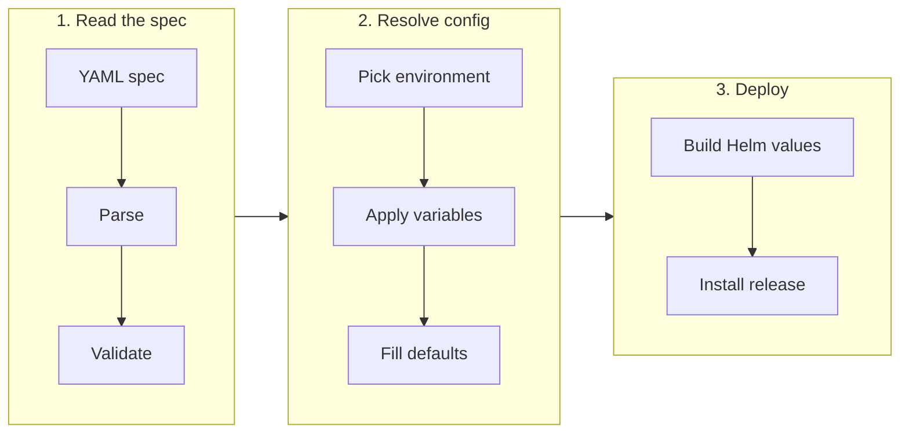

# Deployah

Deployah is a CLI tool that makes deploying apps easy. It uses Helm under the
hood, so you do not need to know Kubernetes or Helm, or even install the `helm`,
`kubectl`, or `kind` tools. It is a single binary.

You write a short **spec**. Deployah turns it into a running **release** on
Kubernetes. We call this **Spec-to-Release**. It is like Source-to-Image (S2I),
but for the deploy step: S2I builds your image, and Deployah runs your release.

## Contents

- [Installation](#installation)
- [Requirements](#requirements)
- [Quick start](#quick-start)
- [How Deployah works](#how-deployah-works)
- [Concepts](#concepts)
- [Writing your spec](#writing-your-spec)
- [Platform file](#platform-file)
- [Profiles](#profiles)
- [Health checks](#health-checks)
- [Commands](#commands)
- [Environments and variables](#environments-and-variables)
- [Precedence rules](#precedence-rules)
- [Accessing your app](#accessing-your-app)
- [Local cluster networking](#local-cluster-networking)
- [Troubleshooting](#troubleshooting)
- [Schema reference](#schema-reference)
- [Development](#development)

## Installation

### Homebrew

```sh
brew install deployah-dev/tap/deployah
```

### Using Nix (recommended)

If you have [Nix](https://nixos.org/download.html) installed:

```sh
# Run without installing
nix run github:deployah-dev/deployah

# Or add it to your flake.nix
inputs.deployah.url = "github:deployah-dev/deployah";
```

### Install with Go

```sh
go install deployah.dev/deployah@latest
```

## Requirements

Deployah is a single binary. You do **not** need the `helm`, `kubectl`, or `kind`
command-line tools. Deployah includes Helm, the Kubernetes client, and Kind as
libraries, so it talks to your cluster by itself.

- **Deploy to a cluster you already have:** you only need access to it (a
  kubeconfig). No container runtime is required.
- **Use the built-in local cluster** (`deployah cluster up`): you need a
  container runtime, either **Docker** or **Podman**. This is the only extra
  tool, and it is needed only for the local cluster.

## Quick start

This walks you through one full deploy on your own machine. It takes about five
minutes. For the local cluster you need Docker or Podman running (see
[Requirements](#requirements)).

You do not need an existing Kubernetes cluster. Deployah can make a local one
for you.

### 1. Start a local cluster

```sh
deployah cluster up
```

This creates a small local Kubernetes cluster (using Kind) and gives it the
context name `kind-deployah`.

### 2. Create a spec

Save this as `deployah.yaml` in an empty folder. It runs the public `nginx`
image, so you do not need to build anything.

```yaml
apiVersion: v1-alpha.2
project: my-first-app
components:
  web:
    image: nginx:latest
    port: 80
    environments: [local]
    expose: true
```

`expose: true` gives the component a hostname made from its name (here
`web.127.0.0.1.nip.io`) with HTTPS, all decided by the platform file.

Deployah also needs a **platform file**, `deployah.platform.yaml`, that maps
the `local` environment to a domain and a Kubernetes context. `deployah cluster
up` creates this for you automatically. See [Platform file](#platform-file).

### 3. Deploy

```sh
deployah deploy local
```

### 4. See it running

```sh
# Show the status of your project
deployah status my-first-app

# Show the local cluster and the URLs you can open
deployah cluster status
```

`deployah cluster status` prints a ready-to-use URL for your app. Open it in
your browser to see the nginx welcome page.

You can also stream the logs:

```sh
deployah logs my-first-app
```

### 5. Clean up

```sh
# Remove the app
deployah delete my-first-app local

# Stop and delete the local cluster
deployah cluster down
```

## How Deployah works

Deployah turns your `deployah.yaml` spec into a running Kubernetes deployment in
three steps.


```mermaid
flowchart LR
    subgraph phase1["1. Read the spec"]
        direction TB
        A["YAML spec"] --> B["Parse"] --> C["Validate"]
    end
    subgraph phase2["2. Resolve config"]
        direction TB
        D["Pick environment"] --> E["Apply variables"] --> F["Fill defaults"]
    end
    subgraph phase3["3. Deploy"]
        direction TB
        G["Build Helm values"] --> H["Install release"]
    end
    phase1 --> phase2 --> phase3
```

1. **Read the spec.** Deployah reads your `deployah.yaml` and checks it against a
   JSON Schema, so mistakes are caught early with clear messages.
2. **Resolve config.** Deployah picks the environment you asked for, substitutes
   your variables, and fills in sensible defaults.
3. **Deploy.** Deployah builds Helm values from your spec and installs a Helm
   release on your cluster. You never write a Helm chart yourself.

For how Deployah compares to similar tools (DevSpace, Werf, Score, Epinio,
Kubero), see [docs/comparison.md](docs/comparison.md).

## Concepts

A few words you will see often.

- **Project.** One app, with a name. The name prefixes the Kubernetes resources
  Deployah creates. It is the `project` field in your spec.
- **Component.** One deployable part of your project, such as a web service or a
  background worker. A project has one or more components.
- **Role.** What a component is for:
  - `service`: it serves traffic and can be exposed (the default).
  - `worker`: a long-running background task, not exposed.
  - `job`: a one-off task that runs and then stops.
- **Kind.** `stateless` (the default, easy to scale) or `stateful` (needs
  persistent storage). Platform teams can already declare storage classes for
  when stateful deploys land; see [Storage classes](#storage-classes).
- **What deploys today.** Deployah currently deploys `stateless` `service`
  components. The `worker` and `job` roles and the `stateful` kind are in the
  schema but are not deployable yet, so a deploy that uses them stops with a
  "not supported yet" error.
- **Environment.** A target such as `dev`, `staging`, or `prod`. Each
  environment can use a different cluster, different files, and different
  variables. The platform file registers which environments exist; an entry
  in the spec's `environments` map only adds overrides for one of them.
- **Resource preset.** A quick way to set CPU and memory without knowing
  Kubernetes units. Use `resourcePreset: small` instead of writing exact values.
  This is not the same as a [profile](#profiles).
- **Profile.** A named deployment policy owned by the platform team (node
  placement, security context, domain and resource ceilings, and more).
  Components select one or more with `profiles: [...]`. See [Profiles](#profiles).
- **Health checks.** Deployah checks that your app is ready for traffic and
  restarts it if it gets stuck. This happens automatically for every service
  component. You can improve the checks by giving Deployah an HTTP endpoint to
  call. See [Health checks](#health-checks).
- **Bring your own image.** Deployah does not build images. You give it an image
  that already exists in a registry your cluster can pull from. Build your image
  in CI (or locally), then let Deployah deploy it.

## Writing your spec

Your spec is a file named `deployah.yaml`. It has three required parts:
`apiVersion`, `project`, and `components`. You also define your `environments`.

Deployah splits configuration across two files, each with a different owner:

- **`deployah.yaml`** (this section). Owned by the developer. Describes what
  to run: image, port, resources, health checks, and which logical domain to
  expose on. It never contains a Kubernetes context or a real domain name.
- **`deployah.platform.yaml`**. Owned by the platform team. Maps each
  environment to a real Kubernetes context, domain, and TLS strategy. See
  [Platform file](#platform-file).

This split means a developer can add an environment or expose a component
without knowing which cluster or domain it runs on, and a platform team can
change clusters or rotate certificates without touching the app spec.

Here is a full example that shows the common fields. You do not need all of
them; most have defaults.

```yaml
apiVersion: v1-alpha.2             # required: the schema version
project: shop                      # required: your project name

components:                        # required: one or more components
  api:
    image: ghcr.io/acme/shop-api:${TAG}  # tag comes from the environment below
    role: service                  # service | worker | job (default: service)
    kind: stateless                 # stateless | stateful (default: stateless)
    port: 8080                     # the port your app listens on (default: 8080)
    environments: [staging, prod]  # which environments deploy this component
    command: ["/bin/api"]          # optional: override the image ENTRYPOINT
    args: ["--verbose"]            # optional: override the image CMD
    env:                           # planned: not applied to the container yet
      LOG_LEVEL: info
    resourcePreset: small          # nano|micro|small|medium|large|xlarge|2xlarge
    expose:                        # optional: `expose: true` uses all defaults
      subdomain: api                # optional: defaults to the component name
      # domain: internal            # optional: defaults to the platform's default domain
      # apex: true                  # optional: use the bare domain instead of a subdomain
    autoscaling:                   # optional: scale on CPU or memory
      enabled: true
      minReplicas: 2
      maxReplicas: 5
      metrics:
        - type: cpu                # cpu | memory
          target: 70               # target usage percentage

environments:                      # define your environments (a map, not a list)
  staging:
    variables:
      TAG: 1.4.0-rc                # fills ${TAG} in the image above
  prod:
    variables:
      TAG: 1.4.0                   # fills ${TAG} in the image above
```

Notice there is no `context` field here: the Kubernetes context for each
environment comes from `deployah.platform.yaml`, not from `deployah.yaml`.

Use either `resourcePreset` or `resources`, not both. Presets are the easy
option; `resources` lets you set exact CPU, memory, and ephemeral storage.

### Field reference

Top level:

| Field | Required | Notes |
|---|---|---|
| `apiVersion` | Yes | The schema version. Must be `v1-alpha.2`. |
| `project` | Yes | Lowercase name (DNS-1123). Prefixes your Kubernetes resources. |
| `components` | Yes | A map of component name to component settings. |
| `environments` | Yes in practice | A map of environment name to environment settings. Keys support prefix-based wildcard matching, e.g. a `review` key matches `--environment review/pr-123`. |

Component:

| Field | Default | Notes |
|---|---|---|
| `image` | none | The container image to run. You provide this. |
| `role` | `service` | `service`, `worker`, or `job`. |
| `kind` | `stateless` | `stateless` or `stateful`. |
| `port` | `8080` | The port your app listens on (1 to 65535). |
| `command` / `args` | none | Override the image ENTRYPOINT and CMD. |
| `env` | none | Environment variables (uppercase keys). |
| `resourcePreset` | none | `nano`, `micro`, `small`, `medium`, `large`, `xlarge`, `2xlarge`. |
| `resources` | none | `cpu`, `memory`, `ephemeralStorage` (Kubernetes units). |
| `expose` | none | `true` for all defaults, or an object with `domain` (defaults to the platform's default domain), `subdomain` (defaults to the component name), and `apex`. See [Platform file](#platform-file). |
| `autoscaling` | off | `enabled`, `minReplicas`, `maxReplicas`, `metrics`. |
| `health` | auto | Ready and alive checks. See [Health checks](#health-checks). |
| `environments` | none | Which environments deploy this component. |
| `profiles` | none | List of platform profile names. Merged left to right. See [Profiles](#profiles). |

> [!IMPORTANT]
> Not deployed yet: the schema accepts `role: worker` and `role: job`,
> `kind: stateful`, and the `env`, `envFile`, and `configFile` fields, but
> Deployah does not apply them at deploy time yet. Today, deploy a
> `stateless` `service` using `image`, `port`, `resources` or
> `resourcePreset`, `expose`, `autoscaling`, and `profiles`.

Environment:

| Field | Notes |
|---|---|
| `envFile` / `configFile` | Files to load for this environment (see below). |
| `variables` | Values for `${...}` placeholders in your spec. |

There is no `context` field on an environment: it comes from the matching
environment key in `deployah.platform.yaml`.

To check your spec, run `deployah validate`; when a platform file exists it
also cross-checks `expose.domain` keys and environment names against it. To
check the full resolution for a given environment, run
`deployah validate <environment>`.

### Value rules

A few fields have specific formats:

- **`port`**: a number from 1 to 65535.
- **`resources.cpu`**: millicores like `500m`, or whole cores like `1` or `2`.
- **`resources.memory`** and **`resources.ephemeralStorage`**: a number with a
  unit, like `256Mi` or `1Gi`.
- **`env`**: keys are uppercase letters, digits, and underscores, and start with
  a letter or underscore (for example `LOG_LEVEL`). Values are a string, number,
  or boolean.
- **`expose`**: `true`, `false`, or an object. `true` means all defaults.
- **`expose.domain`**: a key that must exist in the target environment's
  `domains` map in the platform file. Omit it to use the environment's only
  domain, or the one marked `default: true` there.
- **`expose.subdomain`**: a DNS-1123 label, like `api` or `www`. Omit it to
  use the component name. Cannot be combined with `apex`.
- **`expose.apex`**: set `true` to expose the component at the bare domain
  (e.g. `example.com`) instead of a subdomain.
- **`profiles`**: a list of non-empty strings naming entries in the platform
  file's root-level `profiles` map. Multiple names merge left to right.
  Omit the field to pick up the platform `default` profile when one exists.
  An empty list (`profiles: []`) opts out of every profile, but is rejected
  when a `default` profile is defined.
- **`autoscaling`**: needs `enabled`, `minReplicas`, and `maxReplicas`. Each
  metric has a `type` (`cpu` or `memory`) and a `target` percentage.
- **`health.alive.interval`** and **`health.alive.restartAfter`**: a positive integer
  followed by a unit: `s` (seconds), `m` (minutes), or `h` (hours). For example
  `10s`, `2m`, `1h`. The effective restart time rounds up to the nearest multiple
  of `interval`.
- **Names** (`project`, component names, environment names): lowercase
  letters, digits, and dashes (`-`), and cannot start or end with a dash.
  `project` must be at least 3 characters; component and environment names
  must be at least 2.

### Resource presets

A preset sets CPU and memory for you, so you do not need to know Kubernetes
units. Use `resourcePreset: <name>` on a component instead of writing `resources`.
These are the current values (request / limit):

| Preset | CPU (request / limit) | Memory (request / limit) |
|---|---|---|
| `nano` | 100m / 150m | 128Mi / 192Mi |
| `micro` | 250m / 375m | 256Mi / 384Mi |
| `small` | 500m / 750m | 512Mi / 768Mi |
| `medium` | 500m / 750m | 1024Mi / 1536Mi |
| `large` | 1000m / 1500m | 2048Mi / 3072Mi |
| `xlarge` | 1000m / 3000m | 3072Mi / 6144Mi |
| `2xlarge` | 1000m / 6000m | 3072Mi / 12288Mi |

All presets use the same ephemeral storage: 50Mi request, 2Gi limit.

> [!NOTE]
> Only the request values are applied to the container today. The limit
> values above are defined for future use but are not yet set on the
> Kubernetes resource spec, for presets or for manual `resources`.

### Spec examples

Every example below is complete and valid. Copy one and change the values.

**Smallest spec.** One service, one environment.

```yaml
apiVersion: v1-alpha.2
project: hello
components:
  web:
    image: nginx:latest
    environments: [dev]
environments:
  dev: {}
```

**Two components.** A web app and an API in one project.

```yaml
apiVersion: v1-alpha.2
project: shop
components:
  web:
    image: ghcr.io/acme/web:1.0.0
    port: 80
    environments: [prod]
  api:
    image: ghcr.io/acme/api:1.0.0
    port: 8080
    environments: [prod]
environments:
  prod: {}
```

**Several environments.** Each one has its own image tag. The cluster comes
from the platform file, not from here.

```yaml
apiVersion: v1-alpha.2
project: shop
components:
  web:
    image: ghcr.io/acme/web:${TAG}
    port: 80
    environments: [staging, prod]
environments:
  staging:
    variables:
      TAG: 1.0.0-rc
  prod:
    variables:
      TAG: 1.0.0
```

**Expose it over HTTPS.** `expose: true` is all you need: the hostname is
`web.<baseDomain>` (the component name plus the platform's domain), and TLS
comes from the platform file. Set `subdomain` only when you want a different
label, and `apex: true` for the bare domain.

```yaml
apiVersion: v1-alpha.2
project: shop
components:
  web:
    image: ghcr.io/acme/web:1.0.0
    port: 80
    environments: [prod]
    expose: true
```

**Set exact resources.** Use `resources` instead of a preset.

```yaml
apiVersion: v1-alpha.2
project: shop
components:
  web:
    image: ghcr.io/acme/web:1.0.0
    port: 80
    environments: [prod]
    resources:
      cpu: 500m
      memory: 512Mi
environments:
  prod: {}
```

**Autoscale on CPU.** Scale between 2 and 6 replicas at 70% CPU.

```yaml
apiVersion: v1-alpha.2
project: shop
components:
  web:
    image: ghcr.io/acme/web:1.0.0
    port: 80
    environments: [prod]
    autoscaling:
      enabled: true
      minReplicas: 2
      maxReplicas: 6
      metrics:
        - type: cpu
          target: 70
environments:
  prod: {}
```

## Platform file

A second file, `deployah.platform.yaml`, lives next to `deployah.yaml`. It
owns the environments: it registers which environment names exist, and maps
each one to a real Kubernetes context, one or more domains, a TLS strategy,
and optional storage classes. It can also define org-wide [profiles](#profiles)
at the root. When this file is present, `deployah deploy <environment>` only
accepts names registered here. Any component that uses `expose` or `profiles`
requires it. This file is not processed with `${...}` substitution: it holds
real values, not templates.

```yaml
apiVersion: platform/v1-alpha.1
profiles:
  default:
    nodeSelector:
      workload: general
  public-web:
    podLabels:
      tier: web
    allowedDomains: [public]
  high-security:
    securityContext:
      runAsNonRoot: true
    containerSecurityContext:
      readOnlyRootFilesystem: true
      allowPrivilegeEscalation: false
    maxResources:
      cpu: 1000m
      memory: 2Gi
environments:
  production:
    context: prod-eks
    domains:
      public:
        baseDomain: example.com
        default: true            # used when a component names no domain
        tls:
          mode: certManager
          issuer: letsencrypt-prod
      internal:
        baseDomain: internal.corp
        tls:
          mode: certManager
          issuer: letsencrypt-prod
    storageClasses:
      fast:
        className: fast-ssd
      standard:
        className: gp3
  local:
    context: kind-deployah
    domains:
      public:
        baseDomain: 127.0.0.1.nip.io
        tls:
          mode: selfSigned
```

A component's expose block resolves against the active environment's
`domains` map:

- `expose: true` (or an empty object) uses the environment's **default
  domain** and the **component name** as the subdomain: component `web` on
  `example.com` becomes `web.example.com`.
- The default domain is the environment's only domain, or the one marked
  `default: true` when there are several. Naming several domains without a
  default and omitting `expose.domain` is an error that lists the keys.
- `expose.subdomain: api` overrides the label: `api.example.com`.
- `expose.apex: true` uses the bare domain (`example.com`) instead of a
  subdomain. Only one component can hold the apex per domain.
- When an environment name is matched by wildcard prefix (e.g. `review`
  matching `review/pr-123`), a static, non-templated `expose.subdomain` warns
  by default, since every wildcard match would collide on the same hostname.
  Set `allowStaticSubdomain: true` on that platform environment to allow it.

### TLS modes

| Mode | Meaning |
|---|---|
| `selfSigned` | Deployah generates and manages a self-signed certificate. Used by the local cluster. |
| `secretName` | Use a pre-existing Kubernetes TLS secret in the target namespace. Set `secretName` to its name. |
| `certManager` | Provision the certificate through [cert-manager](https://cert-manager.io/). Set `issuer` to a `ClusterIssuer` or `Issuer` name. |

### Storage classes

Each environment can declare a `storageClasses` map: logical names that map to
real Kubernetes [StorageClass](https://kubernetes.io/docs/concepts/storage/storage-classes/)
names. This is the same idea as `domains`: the platform file owns the cluster
details; a future stateful component will pick a logical name instead of a
cluster-specific class string.

| Field | Notes |
|---|---|
| `storageClasses.<name>` | Logical name you choose (for example `fast` or `standard`). |
| `storageClasses.<name>.className` | The Kubernetes StorageClass name in that cluster (required). |

```yaml
environments:
  production:
    storageClasses:
      fast:
        className: fast-ssd
      standard:
        className: gp3
```

> [!NOTE]
> Profiles can reference a logical `storageClass` from this map. Direct use by
> `kind: stateful` components is not deployable yet.

### Profiles

Profiles are org-wide workload policies defined at the **root** of
`deployah.platform.yaml` (not under an environment). A component selects one
or more by name:

```yaml
# deployah.yaml (developer)
components:
  web:
    image: ghcr.io/acme/web:1.0.0
    port: 80
    environments: [production]
    expose: true
    resourcePreset: small
    profiles: [public-web, high-security]
  api:
    image: ghcr.io/acme/api:1.0.0
    port: 8080
    environments: [production]
    # profiles omitted -> default profile applied when defined
```

```yaml
# deployah.platform.yaml (platform team)
apiVersion: platform/v1-alpha.1
profiles:
  default:
    nodeSelector:
      workload: general
  public-web:
    nodeSelector:
      workload: general
    podLabels:
      tier: web
    allowedDomains: [public]
  high-security:
    securityContext:
      runAsNonRoot: true
    containerSecurityContext:
      readOnlyRootFilesystem: true
      allowPrivilegeEscalation: false
    maxResources:
      cpu: 1000m
      memory: 2Gi
  gpu-inference:
    nodeSelector:
      accelerator: nvidia
    tolerations:
      - key: nvidia.com/gpu
        operator: Exists
        effect: NoSchedule
    storageClass: fast
environments:
  production:
    context: prod-eks
    domains:
      public:
        baseDomain: example.com
        tls:
          mode: certManager
          issuer: letsencrypt-prod
    storageClasses:
      fast:
        className: fast-ssd
```

#### Profile fields

| Field | Type | Notes |
|---|---|---|
| `nodeSelector` | map of string | Kubernetes nodeSelector labels. |
| `tolerations` | list | Kubernetes tolerations (`key`, `operator`, `value`, `effect`). |
| `podLabels` | map of string | Extra labels on pods. |
| `podAnnotations` | map of string | Extra annotations on pods. |
| `securityContext` | object | Pod-level SecurityContext (passed through to the chart). |
| `containerSecurityContext` | object | Container SecurityContext applied to all containers. |
| `storageClass` | string | Logical key from the target environment's `storageClasses` map. |
| `allowedDomains` | list of string | Logical domain keys the component may expose on. Omitted (or null) means no constraint. An empty list (`[]`) is deny-all: no domain is allowed. |
| `maxResources` | object | Ceiling on component resource **requests** (`cpu`, `memory`). Exceeding it is an error. |

#### Merge rules

When a component lists several profiles, Deployah merges them **left to
right** (after prepending `default` when that profile exists):

| Kind | Fields | Rule |
|---|---|---|
| Maps | `nodeSelector`, `podLabels`, `podAnnotations`, security contexts | Deep merge; last wins on key conflict |
| Arrays | `tolerations` | Concatenate; identical entries are deduplicated |
| Scalars | `storageClass` | Last non-empty wins |
| Domains | `allowedDomains` | Intersection of profiles that set a list; omitted means no constraint; empty list is deny-all |
| Ceilings | `maxResources` | Minimum (strictest) wins per resource |

#### Default profile and opt-out

- If the platform defines a profile named `default`, Deployah always prepends
  it when the component omits `profiles` or lists other names.
- `profiles: []` means "no profiles". That is an error when a `default`
  profile exists (you cannot opt out of the org default).
- Setting `profiles` when the platform file has no `profiles` section is an
  error.

#### Interaction with resources and admission

- `resourcePreset` / `resources` still set the component's requests. A
  profile's `maxResources` is only a ceiling; it does not inject defaults.
- Profiles are complementary to cluster admission policies (Pod Security
  Admission, Gatekeeper, and similar). Deployah does not integrate with those
  controllers; use both when your org needs them.

`deployah resolve` and `deployah plan` show the merged profile for each
component (names and key fields such as `nodeSelector`).

### Where the platform file comes from

- `deployah init` scaffolds `deployah.yaml`, plus `deployah.platform.yaml`
  with every environment you selected: `local` gets a full entry, the others
  are registered empty. An empty entry has no context yet, so init prints a
  reminder to set one before deploying somewhere real.
- `deployah cluster up` creates or updates `deployah.platform.yaml` with a
  `local` environment pointed at the local cluster.
- Deployah looks for the platform file in this order: `--platform-file`, the
  `DEPLOYAH_PLATFORM_FILE` environment variable, then the same directory as
  the spec file.

If a component uses `expose` and no platform file can be found, `deployah
deploy` and `deployah validate <environment>` stop with an error rather than
guessing. Use `deployah resolve <environment>` to preview the fully resolved
hostname, TLS mode, and context without touching a cluster:

```sh
deployah resolve production
deployah resolve production --output json
```

### Hostname guard

Once a component has been deployed with a resolved hostname, changing the
domain or subdomain on the next deploy is blocked by default, since it can
silently drop traffic. Pass `--force-hostname-change` to `deployah deploy` to
allow it.

## Health checks

Deployah checks that your app is running and ready for traffic. For every
`service` component with a `port`, Deployah adds three checks automatically:

- **Startup check.** Waits up to 3 minutes for your app to accept connections
  on its port. New pods do not receive traffic until this passes. If the app
  takes longer than 3 minutes to start, the pod is killed and restarted.
- **Ready check.** Runs every 5 seconds. If your app stops accepting
  connections for 15 seconds, traffic is routed to other pods until it recovers.
- **Alive check.** Runs every 10 seconds. If your app is unresponsive for 60
  seconds, the pod is restarted.

With no configuration, all three checks connect to your app's port (TCP). This
works for any app. You can make the checks smarter by giving Deployah an HTTP
endpoint to call.

**Zero config.** All checks run automatically. No `health` block needed.

```yaml
components:
  api:
    image: my-app:1.0.0
    port: 8080
```

**Add a readiness endpoint.** Tell Deployah where to check if your app is ready
for traffic. This also upgrades the startup check to the same endpoint.

```yaml
components:
  api:
    image: my-app:1.0.0
    port: 8080
    health:
      ready:
        path: /health
```

Your `/health` endpoint should return a `2xx` status code when your app can
handle requests. Return `4xx` or `5xx` when it cannot, for example if it is
still connecting to the database.

**Add a separate restart endpoint.** If your app can get stuck in a way that a
restart fixes, give Deployah a separate endpoint to check. If this endpoint
fails for long enough, the pod is restarted.

```yaml
components:
  api:
    image: my-app:1.0.0
    port: 8080
    health:
      ready:
        path: /health
      alive:
        path: /livez
        interval: 10s      # how often to check (default: 10s)
        restartAfter: 60s  # how long to fail before restart (default: 60s)
```

Your `/livez` endpoint should check only whether the process itself is
responsive. Do not check external dependencies (databases, caches) here. If a
dependency is down, let the ready endpoint return an error instead. That stops
traffic without restarting the pod.

**Disable checks.** For a raw TCP service or an app where checks cause
problems, you can disable them individually.

```yaml
components:
  game-server:
    image: my-game:1.0.0
    port: 9000
    health:
      ready: false
      alive: false
```

## Commands

Run `deployah <command> --help` for the full details of any command. A complete,
generated reference for every command and flag is in
[docs/cli/](docs/cli/deployah.md).

Deployah can also generate a shell completion script: run `deployah completion`
(use `-o` to write it to a file). See `deployah completion --help` for details.

### Global flags

These work with every command:

| Flag | Short | Meaning |
|---|---|---|
| `--spec` | `-s` | Path to the spec file (default: `deployah.yaml`). |
| `--platform-file` | | Path to the platform config file (overrides `DEPLOYAH_PLATFORM_FILE` and the default same-directory lookup). |
| `--namespace` | `-n` | Kubernetes namespace to use. |
| `--context` | | Kubernetes context to use (overrides the platform file's context). |
| `--kubeconfig` | `-k` | Path to your kubeconfig file. |
| `--timeout` | `-t` | Timeout for operations (default: 10m). |
| `--debug` | `-d` | Verbose logging, and keep temporary files. |

### Working with apps

| Command | What it does |
|---|---|
| `deployah init` | Create a new spec and platform file by answering a few questions. Use `-o` to set the output file, `--force` to overwrite an existing one, or `--dry-run` to preview. Non-interactive: `--project`, `--environments`, `--set key=value`, or `--defaults` to skip every prompt. |
| `deployah validate` | Check the manifest schema (offline). When a platform file exists, also cross-check `expose.domain` keys and environment names against it. |
| `deployah validate <environment>` | Also load the platform file and check the resolved configuration for that environment. |
| `deployah resolve <environment>` | Preview the fully resolved hostname, TLS mode, and context, offline. Use `--output json` for machine-readable output. |
| `deployah resolve --environments` | List every environment from both files: where it is registered, its context (or the kubeconfig fallback), domains, and overrides. |
| `deployah plan <environment>` | Preview what a deploy would change, without applying anything. Use `--offline` to render and validate with no cluster access, `--drift` to also compare against live cluster state, or `--output json` for CI. |
| `deployah deploy <environment>` | Deploy your project. Shows the plan and asks for confirmation before applying; use `-y`/`--yes` to skip the prompt, `--reapply` to upgrade even with no changes, `--explain` to print the resolution report first, or `--force-hostname-change` to bypass the hostname guard. |
| `deployah status <project>` | Show the status of a deployed project. Use `--detailed` for pod details, `-e` for an environment. |
| `deployah logs <project>` | Stream logs. Filter with `--component`, `-e`, `--container`, `--since`, `--tail`. Use `--no-follow` for a one-off read. |
| `deployah shell <project>` | Open a shell in a running container. Choose with `--component` and `--container`. |
| `deployah list` | List deployed projects. Filter with `-p` (project) and `-e` (environment). |
| `deployah delete <project> <environment>` | Remove a deployment. Fails if no platform file is found, unless you pass `--allow-missing-platform`. Use `-y`/`--yes` to skip the prompt, `--dry-run` or `--show-resources` to preview, and `--wait` to block until resources are gone. |

### Working with the local cluster

| Command | What it does |
|---|---|
| `deployah cluster up` | Create the local cluster, start the cloud provider, and create or update `deployah.platform.yaml` with a `local` environment. |
| `deployah cluster status` | Show the cluster status and the URLs you can open. |
| `deployah cluster down` | Delete the local cluster. Use `--force` to skip the prompt. |
| `deployah cluster kubeconfig` | Print the local cluster kubeconfig path. Use `--raw` for its contents. |

## Environments and variables

Deployah supports multiple environments (for example `dev`, `staging`, `prod`).
The [platform file](#platform-file) registers them, and you choose one when
you deploy:

```sh
deployah deploy staging
```

The `environments` section in `deployah.yaml` is optional. Add an entry only
when an environment needs its own substitution values or env file:

```yaml
environments:
  production:
    variables:
      TAG: v1.4.2
```

### How the environment is picked

When you name an environment, Deployah checks it against a registry: the
platform file's environments when that file exists, otherwise the spec's
`environments` keys, if any are defined. A name outside the registry is an
error that lists the valid names. With no registry at all, any name is
accepted. Matching is exact first, then by prefix: a `review` entry matches
`review/pr-123`.

When you do not name one: a single registered environment is selected
automatically, several make Deployah stop and list them, and none means a
built-in `default` environment is used.

### Two kinds of variables

It helps to know there are two different things:

1. **Substitution variables.** These fill `${...}` placeholders in your spec
   before Deployah reads it. Use them to change the spec itself, such as the
   image tag or the ingress host. This works today and is described below.
2. **Container environment variables.** These are the variables your app reads
   at runtime. You would set them with the `env` field on a component. Note:
   that field is accepted by the schema but is **not applied to the running
   container yet** (it is planned). For now, put runtime values into your image
   or your app's own config.

### Substitution variables

You can use `${NAME}` placeholders anywhere in your spec. Two forms are
supported:

- `${NAME}` is required. If the variable is not set, Deployah stops with an
  error ("variable not set"). This stops you from deploying with a missing
  value.
- `${NAME:-default}` uses `default` when the variable is not set.

For example:

```yaml
components:
  web:
    image: nginx:${TAG:-latest}   # uses "latest" when TAG is not set
    port: 80
    environments: [prod]
```

Deployah uses [fluxcd/pkg/envsubst](https://github.com/fluxcd/pkg/envsubst) under
the hood, so more shell-style forms work too. The full list is below.

#### All supported forms

These forms come from
[fluxcd/pkg/envsubst](https://github.com/fluxcd/pkg/tree/main/envsubst#supported-functions).
In the table, `var` is your variable name.

| Expression | Meaning |
|---|---|
| `${var}` | The value of `var`. |
| `${#var}` | The length of `var`. |
| `${var^}` | Uppercase the first character. |
| `${var^^}` | Uppercase all characters. |
| `${var,}` | Lowercase the first character. |
| `${var,,}` | Lowercase all characters. |
| `${var:n}` | Start `n` characters in. |
| `${var:n:len}` | Start `n` characters in, take up to `len` characters. |
| `${var#pattern}` | Remove the shortest `pattern` match from the start. |
| `${var##pattern}` | Remove the longest `pattern` match from the start. |
| `${var%pattern}` | Remove the shortest `pattern` match from the end. |
| `${var%%pattern}` | Remove the longest `pattern` match from the end. |
| `${var-default}` | Use `default` if `var` is not set. |
| `${var:-default}` | Use `default` if `var` is not set or is empty. |
| `${var=default}` | Use `default` if `var` is not set. |
| `${var:=default}` | Use `default` if `var` is not set or is empty. |
| `${var/pattern/replacement}` | Replace the first `pattern` match with `replacement`. |
| `${var//pattern/replacement}` | Replace every `pattern` match with `replacement`. |
| `${var/#pattern/replacement}` | Replace a `pattern` match at the start with `replacement`. |
| `${var/%pattern/replacement}` | Replace a `pattern` match at the end with `replacement`. |

Remember: Deployah runs in strict mode. A variable with no default must be set,
or the deploy stops with an error.

### Where values come from

Deployah looks for a variable in three places. If the same name is set in more
than one place, the later one wins (lowest to highest):

1. **The environment's `variables`** in your spec. Write these with their plain
   name, with no prefix.
2. **The environment's env file**, for example `.env.production`. Only keys that
   start with `DPY_VAR_` are used, and the prefix is removed.
3. **Your shell**, also with the `DPY_VAR_` prefix.

So the same `${APP_ENV}` can come from any of these:

```yaml
# in deployah.yaml (no prefix here)
environments:
  production:
    variables:
      APP_ENV: from-spec
```

```env
# in .env.production (needs the prefix)
DPY_VAR_APP_ENV=from-envfile
```

```sh
# in your shell (needs the prefix)
export DPY_VAR_APP_ENV=from-shell
```

With all three set, `${APP_ENV}` is `from-shell`, because the shell wins.

> [!NOTE]
> Only env-file and shell variables need the `DPY_VAR_` prefix, because
> Deployah has to pick its own variables out of all the others on your system.
> The `variables` you write inside the spec do not need a prefix.

### Env files

An env file is a simple list of `KEY=value` lines. Blank lines and lines that
start with `#` are ignored, and spaces around the key and value are trimmed.

If you do not set `envFile` for an environment, Deployah looks for a file in
this order and uses the first one it finds:

1. `.env.<environment>` (for example `.env.production`)
2. `.deployah/.env.<environment>`
3. `.env`
4. `.deployah/.env`

If you do set `envFile` and the file is missing, Deployah stops with an error.

### Files: Deployah vs. your app

| File | Used by | Purpose |
|---|---|---|
| `deployah.yaml` | Deployah | Your spec. |
| `.env` / `.env.<env>` | Deployah and your app | Variables. Deployah only reads the keys that start with `DPY_VAR_`. |
| `config.yaml` / `config.<env>.yaml` | Your app | Your app's own config. Deployah ignores these. |

Keys in an env file that do not start with `DPY_VAR_` are left alone. Deployah
does not use them, so they are free for your app to read on its own. The `config`
files are for your app only.

## Precedence rules

Several settings can come from more than one place. This table shows the
order Deployah checks them in; the first match wins.

| Setting | Order (first match wins) |
|---|---|
| Environment registry (which names you may deploy to) | platform file environments → spec `environments` keys → any name |
| Environment selection (no name given) | the single registered environment → error listing them when there are several → built-in `default` when there are none |
| Kubernetes context | `--context` flag → `context` in the platform file for that environment → your kubeconfig's current context |
| Expose domain | `expose.domain` in the spec → the domain marked `default: true` in the platform file → the environment's only domain |
| Expose hostname label | `expose.apex: true` (bare domain) → `expose.subdomain` in the spec → the component name |
| Profiles | component `profiles` list (with platform `default` prepended when defined) → merged left to right; omitted field applies only `default` when present |
| Substitution variables (`${...}`) | shell `DPY_VAR_*` → env file `DPY_VAR_*` → the environment's `variables` in the spec |
| Env file | explicit `envFile` in the spec → `.env.<env>` → `.deployah/.env.<env>` → `.env` → `.deployah/.env` |
| Platform file location | `--platform-file` flag → `DEPLOYAH_PLATFORM_FILE` env var → same directory as the spec |

Two context situations print a warning, so a deploy to the wrong cluster is
visible before it happens:

- `--context` overrides the platform file's context for the environment.
  Silence it with `DEPLOYAH_ALLOW_CONTEXT_MISMATCH=1`.
- The environment has no context anywhere. The deploy then follows your
  kubeconfig's current context, and the warning names that context.

## Accessing your app

To reach a component over HTTP or HTTPS, give it `expose: true`. Its hostname
comes from the component name plus the platform file's domain:

```yaml
# deployah.yaml
components:
  web:
    image: nginx:latest
    port: 80
    environments: [local]
    expose: true
```

```yaml
# deployah.platform.yaml (created for you by 'deployah cluster up')
environments:
  local:
    context: kind-deployah
    domains:
      public:
        baseDomain: 127.0.0.1.nip.io
        tls:
          mode: selfSigned
```

On the local cluster, run `deployah cluster status` to see the resolved URL
and port for your app. Open that URL in your browser; nip.io resolves to
`127.0.0.1` for you, so you do not need extra setup or `/etc/hosts` entries.

## Local cluster networking

The local cluster runs [Kind](https://kind.sigs.k8s.io/) (Kubernetes in Docker)
with [cloud-provider-kind](https://github.com/kubernetes-sigs/cloud-provider-kind)
for LoadBalancer, Ingress, and Gateway API support.

On Linux and macOS, services are reachable on `localhost` through Docker port
mapping. The path traffic takes is:

```text
localhost:<port>
  -> Docker port mapping
    -> Envoy gateway container
      -> Kind cluster pod
```

On macOS and other Docker-in-VM setups (Lima, Colima, Docker Desktop, OrbStack),
there is one more layer. Your Docker runtime forwards the VM port to the host
automatically, so you do not configure anything:

```text
macOS localhost:<port>
  -> VM port forwarding (automatic)
    -> Docker port mapping
      -> Envoy gateway container
        -> Kind cluster pod
```

> [!NOTE]
> LoadBalancer, Ingress, and Gateway API need a rootful Docker daemon.
> Rootless Docker cannot mount the Docker socket into the `cloud-provider-kind`
> container, so it cannot manage LoadBalancer resources.

Run `deployah cluster status` at any time to see the assigned ports and URLs for
all Ingress and LoadBalancer resources.

## Troubleshooting

### Spec and deployment

**Spec is missing a required field.**

```sh
error: load spec: ... spec is missing 'apiVersion' field
```

Your spec needs `apiVersion`, `project`, and `components`, and an `environments`
map. Run `deployah validate` to find the problem.

**Environment not found.**

```sh
error: environment "production" not found
```

Check the environment name in your spec, or run `deployah list` to see what is
deployed.

**Variable not found.**

```sh
error: variable ${IMAGE} not found
```

Define the variable in the environment's `variables`, or in your env file or
shell with the `DPY_VAR_` prefix.

**Cannot connect to Kubernetes.**

```sh
error: unable to connect to Kubernetes cluster
```

Check that your cluster is reachable with `kubectl cluster-info`. For a local
cluster, run `deployah cluster up` and deploy with the `local` environment (or
pass `--context kind-deployah`).

### Deploy succeeds but the app returns 503 / times out over HTTPS

**Symptom.** `deployah deploy` completes, the pod is Running and 1/1, but
requests to the app fail:

```text
< HTTP/1.1 503 Service Unavailable
< server: envoy
upstream connect error or disconnect/reset before headers. reset reason: connection timeout
```

`kubectl port-forward svc/<project>-<env>-web 8080:80` works, which confirms
the pod is healthy and only the ingress path is broken.

**Cause.** The local cluster uses cloud-provider-kind to serve ingress. Its
Envoy gateway runs in a container and forwards traffic from the container
network into the cluster. When the host drops that forwarded traffic, Envoy
returns 503 -- even though the pod is fine. This is a host networking issue, not
a Deployah or app problem.

#### Linux

The host's iptables `FORWARD` chain defaults to `DROP` (set by Docker, or
re-imposed by firewalld/ufw), which silently drops the gateway's traffic.

Confirm:

```sh
sudo iptables -S FORWARD | head -1
# -P FORWARD DROP   <-- this is the cause
```

Find the Kind bridge interface:

```sh
bridge=br-$(docker network inspect kind -f '{{.Id}}' | cut -c1-12)
```

Then apply one of these fixes:

**firewalld:**

```sh
sudo firewall-cmd --permanent --zone=trusted --change-interface="$bridge"
sudo firewall-cmd --reload
```

**iptables / nftables** (survives Docker restarts without opening the whole
host):

```sh
sudo iptables -I DOCKER-USER -o "$bridge" -j ACCEPT
sudo iptables -I DOCKER-USER -i "$bridge" -j ACCEPT
```

**ufw:** set `DEFAULT_FORWARD_POLICY="ACCEPT"` in `/etc/default/ufw`, then run
`sudo ufw reload`.

Re-run your request afterwards. Avoid `sudo iptables -P FORWARD ACCEPT` -- it
works but opens the entire host to forwarded traffic.

#### macOS (Docker Desktop / OrbStack / Podman machine)

The Docker daemon runs inside a Linux VM, so there is no host firewall rule to
change. Instead:

- Always reach the app via `127.0.0.1`, never a `172.x` container address.
  Deployah publishes ingress on `127.0.0.1` by default.
- Recreate the cluster: `deployah cluster down && deployah cluster up`.
- Restart the VM: quit and reopen Docker Desktop, or `orb restart`, or
  `podman machine stop && podman machine start`.
- If the problem persists, see the
  [upstream issue](https://github.com/kubernetes-sigs/cloud-provider-kind/issues/142).

#### Reach the app while you fix the above

```sh
kubectl --kubeconfig "$(deployah cluster kubeconfig)" \
  port-forward svc/<project>-<env>-web 8080:80
curl http://localhost:8080
```

### Local cluster networking

**Services return "Empty reply from server" on macOS (Lima).**

Lima's VZ driver uses a usernet port forwarder by default, which has a known
issue with the custom Docker network that Kind creates. To fix it, edit your
Lima config:

```sh
limactl stop <instance>
limactl edit <instance>
```

Make sure both settings are present at the top level:

```yaml
ssh:
  overVsock: false

portForwards:
  - guestIPMustBeZero: true
    guestPortRange: [1, 65535]
    hostIP: 127.0.0.1
  - guestSocket: "/var/run/docker.sock"
    hostSocket: "{{.Dir}}/sock/docker.sock"
```

Then restart:

```sh
limactl start <instance>
```

`ssh.overVsock: false` switches Lima to the standard SSH port forwarder. The
`portForwards` rule forwards all guest ports to the host, which is needed for
the dynamic Docker ports.

**"permission denied" in cloud-provider-kind logs.**

The cloud provider needs a rootful Docker daemon. If you use Lima, create a
rootful instance:

```sh
limactl start template:docker-rootful
```

**Firewall blocks gateway ports.**

Gateway ports are bound on all interfaces (`0.0.0.0`). On Linux, allow the
mapped ports in your firewall. On macOS, the Application Firewall may ask for
permission. Allow it when prompted.

### Getting help

```sh
deployah --help
deployah <command> --help
```

## Schema reference

Deployah validates your spec and platform file with JSON Schema.

- **Manifest schema version:** v1-alpha.2
- **Manifest schema:** `internal/spec/schema/v1-alpha.2/manifest.json`
- **Manifest environments schema:** `internal/spec/schema/v1-alpha.2/environments.json`
- **Platform schema version:** platform/v1-alpha.1
- **Platform schema:** `internal/spec/schema/platform/v1-alpha.1/platform.json`

For the latest schema and examples, see the
[schema directory](internal/spec/schema/) in the repository.

## Development

The Nix flake is the main dev and CI interface. With
[direnv](https://direnv.net/) (the `.envrc` uses `use flake`), the tools load
automatically when you enter the repo.

```sh
nix develop
```

### Format, lint, and tidy

```sh
nix run .#fmt                  # format Go (gofumpt + gci)
nix run .#lint                 # golangci-lint
nix run .#lint-md              # markdownlint
nix run .#tidy                 # go mod tidy
nix run .#update-vendor-hash   # refresh vendorHash after go.sum changes
```

### Tests

Unit and integration tests are split by build tag. Plain `go test ./...` skips
the integration tests.

```sh
nix run .#test-unit          # unit tests with the race detector
nix run .#test-integration   # scenario tests in internal/testing
```

Coverage profiles are written to `coverage-unit.out` and
`coverage-integration.out`.

### Build and run

```sh
nix build              # build the deployah binary
nix run . -- --help    # run without installing
```

### CI

GitHub Actions runs flake validation, lint/fmt/tidy checks, `nix run .#test-unit`,
and `nix run .#test-integration` on every pull request and push to `main`.
Scenario fixtures under `scenarios/` (including `deployah.yaml` and
`deployah.platform.yaml`) are tracked so integration tests can run on a clean
checkout.

```sh
nix flake check   # runs the pre-commit hooks (lint, markdownlint, tidy, nixfmt)
```

Format Nix files with `nix fmt`.
