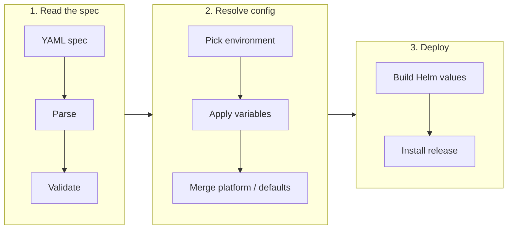

# Deployah

[](https://codecov.io/gh/deployah-dev/deployah)
[](https://www.bestpractices.dev/projects/13862)
[](https://scorecard.dev/viewer/?uri=github.com/deployah-dev/deployah)
[](https://deepwiki.com/deployah-dev/deployah)

<!-- markdownlint-disable MD033 -->
<p align="center">
  
</p>
<!-- markdownlint-enable MD033 -->

Deployah is a CLI that deploys apps to Kubernetes. You write a short **spec**.
Deployah turns it into a running Helm **release**. That flow is
**Spec-to-Release**: like Source-to-Image (S2I), but for the deploy step. S2I
builds your image. Deployah runs your release.

The binary embeds the Helm and Kubernetes clients. It installs nothing in your
cluster. You do not maintain a chart.

## Who this is for

Deployah is for teams that already use Kubernetes and want a clear ownership
boundary between the app and the platform.

- **App / developer** owns `deployah.yaml`: image, port, resources, expose
  intent, scaling, persistence, workers. No Kubernetes context. No real domain
  names.
- **Platform** owns `deployah.platform.yaml`: cluster contexts, domains, TLS,
  and profiles (placement, security, monitor labels, and related policy).

You still need a cluster you can reach (kubeconfig). Deployah talks to that
cluster itself.

### Use Deployah when

- You want multi-environment app deploys without maintaining a chart per app
- Platform policy (domains, TLS, profiles) should change without editing every
  app spec
- The common shapes are enough: Deployment/StatefulSet, Service, Ingress, HPA,
  PVC, workers, ServiceMonitor/PodMonitor

### Do not use Deployah when

- You already have a Helm chart and release process you trust for that app
- You only need a one-shot (`kubectl create deployment` or `helm install` of a
  third-party chart)
- You need an operator-managed database or other specialized controllers

You operate Kubernetes yourself. Spec-to-Release replaces a per-app chart with
a short app spec and a platform map.

For how Deployah compares to DevSpace, Werf, Score, Epinio, and Kubero, see
[docs/comparison.md](docs/comparison.md).

## Features

- **Spec-to-Release** - short `deployah.yaml` becomes a Helm release; no chart
  to maintain
- **Ownership split** - app owns the spec; platform owns contexts, domains,
  TLS, and profiles
- **Any reachable cluster** - uses your kubeconfig; installs nothing in the
  cluster
- **One binary** - embeds Helm and the Kubernetes client (no separate `helm` /
  `kubectl` required)
- **Services and workers** - HTTP services with Ingress, or `role: worker`
  without Service/Ingress
- **Stateless and stateful** - Deployments or StatefulSets, optional PVCs,
  volume resize
- **Custom environments** - name your own environments (`local`, `staging`,
  `prod`), plus prefix-matched targets like `review/pr-123`; platform maps each
  one to a cluster, domains, and TLS
- **Profiles** - platform policy for placement, security, resources, and scrape
  labels
- **Autoscaling and health** - HPA, ready/alive checks (HTTP/TCP or exec for
  workers)
- **Metrics** - ServiceMonitor / PodMonitor when Prometheus Operator is present
- **Extras** - custom manifests and CRDs under `.deployah/`
- **Plan before apply** - `deployah plan` / `deployah deploy` with validation
  and deploy guards

## Current limitations

- **`env` is not applied to Deployments yet.** The `env` field on a component
  passes schema validation but does not reach the running container. Task
  `env` is inlined onto Jobs. See
  [Two kinds of variables](docs/configuration.md#two-kinds-of-variables).
- **Deployah does not build images.** Give it an image that already exists in a
  registry your cluster can pull from.
- **Stateful with persistence needs Kubernetes 1.32 or newer.** Deployah checks
  the API version and fails fast on older clusters. Identity-only stateful
  components have no such floor.
- **The schemas are alpha.** App manifests are at `v1-alpha.5` and platform
  files at `platform/v1-alpha.3`; expect breaking changes between releases.

## Contents

- **Get it running**
  - [Installation](#installation)
  - [Requirements](#requirements)
  - [Quick start](#quick-start)
  - [Examples](#examples)
- **Understand the model**
  - [How Deployah works](#how-deployah-works)
  - [What Deployah decides for you](#what-deployah-decides-for-you)
  - [Concepts](#concepts)
- **Look things up**
  - [Guides](#guides)
  - [Commands](#commands)
  - [Schema reference](#schema-reference)
- **Contribute**
  - [Community](#community)
  - [Development](#development)
  - [License](#license)

## Installation

### Homebrew

```sh
brew install deployah-dev/tap/deployah
```

### Using Nix (recommended)

If you have [Nix](https://nixos.org/download.html) installed:

```sh
# Run without installing
nix run github:deployah-dev/deployah

# Or add it to your flake.nix
inputs.deployah.url = "github:deployah-dev/deployah";
```

### Install with Go

```sh
go install deployah.dev/deployah@latest
```

## Requirements

Deployah is a single binary. You do **not** need the `helm`, `kubectl`, or `kind`
command-line tools. Deployah includes Helm, the Kubernetes client, and Kind as
libraries, so it talks to your cluster by itself.

- **Deploy to a cluster you already have:** you only need access to it (a
  kubeconfig). No container runtime is required.
- **Use the built-in local cluster** (`deployah cluster up`): you need a
  container runtime, either **Docker** or **Podman**. This is the only extra
  tool, and it is needed only for the local cluster.

## Quick start

A full local deploy takes about five minutes. For the local cluster you need
Docker or Podman running (see [Requirements](#requirements)).

You do not need an existing Kubernetes cluster. Deployah can make a local one
for you.

Deployah reads two files, with two different owners (see
[Who this is for](#who-this-is-for)):

- `deployah.yaml` - what to run. You write this one.
- `deployah.platform.yaml` - where it runs. In this walkthrough,
  `deployah cluster up` writes it for you. On a real cluster, a platform team
  writes it once.

### 1. Start a local cluster

```sh
deployah cluster up
```

This creates a small local Kubernetes cluster (using Kind) and gives it the
context name `kind-deployah`.

### 2. Create a spec

Save this as `deployah.yaml` in an empty folder. It runs the public `nginx`
image, so you do not need to build anything.

```yaml
apiVersion: v1-alpha.5
project: my-first-app
components:
  web:
    image: nginx:latest
    port: 80
    environments: [local]   # deploy this component in the "local" environment
    expose: true
```

`expose: true` gives the component a hostname made from its name (here
`web.127.0.0.1.nip.io`) with HTTPS, all decided by the platform file.

You do not write `deployah.platform.yaml` here: `deployah cluster up` already
created it and registered the `local` environment with a domain and a
Kubernetes context. See the [platform file guide](docs/platform.md) for its
shape.

### 3. Deploy

```sh
deployah deploy local
```

### 4. See it running

```sh
# Show the status of your project
deployah status my-first-app

# Show the local cluster and the URLs you can open
deployah cluster status
```

`deployah cluster status` prints a ready-to-use URL for your app. Open it in
your browser to see the nginx welcome page.

You can also stream the logs:

```sh
deployah logs my-first-app
```

### 5. Clean up

```sh
# Remove the app
deployah delete my-first-app local

# Stop and delete the local cluster
deployah cluster down
```

Next, read [Concepts](#concepts) for the vocabulary, then pick the guide you
need from [Guides](#guides).

## Examples

Runnable specs live under [`examples/`](examples/). Start with
[`examples/nginx`](examples/nginx): the same flow as the quick start, ready to
copy.

## How Deployah works

Deployah turns your `deployah.yaml` spec into a running Kubernetes deployment in
three steps.


```mermaid
flowchart LR
    subgraph phase1["1. Read the spec"]
        direction TB
        A["YAML spec"] --> B["Parse"] --> C["Validate"]
    end
    subgraph phase2["2. Resolve config"]
        direction TB
        D["Pick environment"] --> E["Apply variables"] --> F["Merge platform / defaults"]
    end
    subgraph phase3["3. Deploy"]
        direction TB
        G["Build Helm values"] --> H["Install release"]
    end
    phase1 --> phase2 --> phase3
```

1. **Read the spec.** Deployah reads your `deployah.yaml` and checks it against a
   JSON Schema.
2. **Resolve config.** Deployah picks the environment you asked for, substitutes
   your variables, merges the platform file and any profiles, and fills in
   defaults.
3. **Deploy.** Deployah builds Helm values from your spec and installs a Helm
   release on your cluster. You do not write a Helm chart.

The spec is a smaller surface than the Kubernetes API on purpose, so step 2 adds
fields you did not write. You can read the result before anything is applied:

```sh
deployah plan <environment> --offline --raw --yaml
```

`--offline` renders without touching a cluster, `--raw` prints raw Kubernetes
field paths instead of the compact Deployah vocabulary, and `--yaml` shows
changed fields as YAML blocks. For the resolved hostname, TLS mode, and context,
use `deployah resolve <environment>` (also offline, `--output json` for CI).

For how Deployah compares to similar tools (DevSpace, Werf, Score, Epinio,
Kubero), see [docs/comparison.md](docs/comparison.md).

## What Deployah decides for you

These are the defaults step 2 fills in. Most are overridable.
`deployah plan --raw` shows the rendered resources; `deployah resolve` shows
hostname and TLS.

| Decision | Default | Set it with |
|---|---|---|
| Workload type | Deployment; `stateful` gives a StatefulSet plus a headless Service | [`kind`](docs/workloads.md#stateful-workloads) |
| Port | `8080` for services; workers get no port, Service, or Ingress | `port`, [`role`](docs/workloads.md#worker-components) |
| Replicas | `1`, unless autoscaling is on | `replicas`, `autoscaling` |
| Probes | Services with a port get three TCP checks: startup (up to 3 minutes), ready (every 5s, out of rotation after 15s), alive (every 10s, restart after 60s) | [`health`](docs/workloads.md#health-checks) |
| Graceful stop | 30s for services, 60s for workers | `shutdownTimeout` |
| CPU and memory | Nothing is set unless you ask; only requests are applied today (limits on presets and on `resources` are ignored) | [`resourcePreset`, `resources`](docs/spec-reference.md#resource-presets) |
| Persistence | Access mode fixed at `ReadWriteOncePod` (stateful) or `ReadWriteOnce` (stateless); kept on delete and scale-down (`Retain`) | size and mount via [`persistence`](docs/workloads.md#access-mode-and-pvc-retention); retention via profile `pvcRetentionPolicy` (access mode is not settable) |
| Hostname and TLS | When `expose` is set: component name plus the environment's default domain, TLS from the platform file | [`expose`](docs/platform.md), platform file |
| Placement and security | From merged profiles, including the platform `default` profile when present | [`profiles`](docs/platform.md#profiles) |

Deployah generates these common shapes: Deployment, StatefulSet, Service,
headless Service, Ingress, HPA, PVC, ServiceMonitor, and PodMonitor. With
`tls.mode: selfSigned` it also emits a TLS Secret for the hostname. Anything
outside that set goes in as plain Kubernetes YAML under `.deployah/`; see
[custom manifests and CRDs](docs/custom-manifests-and-crds.md).

## Concepts

- **Project.** One app, with a name. The name prefixes the Kubernetes resources
  Deployah creates. It is the `project` field in your spec.
- **Component.** One deployable part of your project, such as a web service or a
  background worker. A project has one or more components.
- **Role.** What a component is for:
  - `service`: it serves traffic and can be exposed (the default).
  - `worker`: a long-running background task, not exposed.
- **Task.** Run-to-completion work (`preDeploy`, `postDeploy`, `schedule`, or
  `manual`). See [Tasks](docs/tasks.md).
- **Kind.** The component's `kind` field: `stateless` (the default) or
  `stateful` (StatefulSet with stable identity; optional per-pod volumes). This
  field has nothing to do with Kind, the tool that runs the optional local
  cluster. See
  [Stateful workloads](docs/workloads.md#stateful-workloads) and
  [Storage classes](docs/platform.md#storage-classes).
- **Workload matrix.** `role` and `kind` combine independently. Run-to-completion
  work is `tasks:`, not a component role.

  | Capability          | service+stateless | service+stateful | worker+stateless | worker+stateful |
  |---------------------|:-----------------:|:----------------:|:----------------:|:---------------:|
  | Deployment          | Y | - | Y | - |
  | StatefulSet         | - | Y | - | Y |
  | ClusterIP Service   | Y | Y | - | - |
  | Headless Service    | - | Y | - | Y |
  | Ingress             | Y | Y | - | - |
  | HPA                 | Y | Y | Y | Y |
  | Persistence         | Y | Y | Y | Y |
  | Health (TCP/HTTP)   | Y | Y | - | - |
  | Health (exec)       | Y | Y | Y | Y |
  | ServiceMonitor      | Y | Y | - | - |
  | PodMonitor          | - | - | Y | Y |

- **Environment.** A target such as `dev`, `staging`, or `prod`. Each
  environment can use a different cluster, different files, and different
  variables.

  The word `environments` appears in three places, and each one does a
  different job:

  | Where | This guide calls it | What it does |
  |---|---|---|
  | `environments` in the platform file | environment **registry** | Declares which environment names exist, and maps each to a cluster context, domains, and TLS |
  | `environments` at the top of `deployah.yaml` | environment **overrides** | Optional per-environment substitution variables and env file |
  | `environments` inside a component | environment **filter** | Restricts that component to the listed environments |

- **Resource preset.** Set CPU and memory without Kubernetes units. Use
  `resourcePreset: small` instead of writing exact values. This is not the same
  as a [profile](docs/platform.md#profiles).
- **Profile.** A named deployment policy owned by the platform team (node
  placement, security context, domain and resource ceilings, monitor labels,
  and more). Components select one or more with `profiles: [...]`. See
  [Profiles](docs/platform.md#profiles).
- **Health checks.** Services get automatic TCP/HTTP ready and alive checks.
  Workers use process-exit by default, or optional `health.alive.exec`. See
  [Health checks](docs/workloads.md#health-checks) and
  [Worker components](docs/workloads.md#worker-components).
- **Bring your own image.** Deployah does not build images. You give it an image
  that already exists in a registry your cluster can pull from. Build your image
  in CI (or locally), then let Deployah deploy it.

## Guides

Field-level detail lives in `docs/`:

| Guide | What is in it |
|---|---|
| [Spec reference](docs/spec-reference.md) | Every `deployah.yaml` field, value rules, resource presets, and full examples. |
| [Platform file](docs/platform.md) | Contexts, domains, TLS modes, storage classes, and profiles. |
| [Workloads](docs/workloads.md) | Stateful components and volumes, workers, health checks, metrics. |
| [Tasks](docs/tasks.md) | Migrations, smoke checks, scheduled CronJobs, `deployah run`, and fanout. |
| [Configuration](docs/configuration.md) | Environment selection, variables, `.env` files, precedence rules. |
| [Networking](docs/networking.md) | Reaching your app, and how the local cluster resolves hostnames. |
| [Custom manifests and CRDs](docs/custom-manifests-and-crds.md) | Ship plain Kubernetes YAML alongside the release. |
| [Troubleshooting](docs/troubleshooting.md) | What to do when a deploy or a hostname does not work. |
| [Deployah vs. similar tools](docs/comparison.md) | Comparison with DevSpace, Werf, Score, Epinio, and Kubero. |
| [CLI reference](docs/cli/deployah.md) | Generated documentation for every command and flag. |

## Commands

Run `deployah <command> --help` for the full details of any command. A complete,
generated reference for every command and flag is in
[docs/cli/](docs/cli/deployah.md).

Deployah can also generate a shell completion script: run `deployah completion`
(use `-o` to write it to a file). See `deployah completion --help` for details.

### Global flags

These work with every command:

| Flag | Short | Meaning |
|---|---|---|
| `--spec` | `-s` | Path to the spec file (default: `deployah.yaml`). |
| `--platform-file` | | Path to the platform config file (overrides `DEPLOYAH_PLATFORM_FILE` and the default same-directory lookup). |
| `--namespace` | `-n` | Kubernetes namespace to use. |
| `--context` | | Kubernetes context to use (overrides the platform file's context). |
| `--kubeconfig` | `-k` | Path to your kubeconfig file. |
| `--timeout` | `-t` | Timeout for operations (default: 10m). |
| `--debug` | `-d` | Verbose logging, and keep temporary files. |

### Working with apps

| Command | What it does |
|---|---|
| `deployah init` | Interactive wizard that creates a spec and platform file, plus `.deployah/manifests/` and `.deployah/crds/` for [custom manifests and CRDs](docs/custom-manifests-and-crds.md). Requires a terminal. Use `--force` to skip the overwrite prompt when a spec already exists (you still confirm Save), `--dry-run` to preview, `--spec`/`-s` for the spec path, and `--platform-file` for the platform path. |
| `deployah validate` | Check the manifest schema (offline). When a platform file exists, also cross-check `expose.domain` keys and environment names against it. |
| `deployah validate <environment>` | Also load the platform file and check the resolved configuration for that environment. |
| `deployah resolve <environment>` | Preview the fully resolved hostname, TLS mode, and context, offline. Use `--output json` for machine-readable output. |
| `deployah resolve --environments` | List every environment from both files: where it is registered, its context (or the kubeconfig fallback), domains, and overrides. |
| `deployah plan <environment>` | Preview what a deploy would change, without applying anything. Extra manifests from `.deployah/manifests/` appear in the diff; pending CRDs are reported but not applied. Use `--offline` to render with no cluster access, `--raw` for raw Kubernetes field paths instead of the compact Deployah vocabulary, `--yaml` to show changed fields as YAML blocks, `--drift` to also compare against live cluster state, `--detailed-exitcode` to exit 2 when changes are pending, or `--output json` for CI. |
| `deployah deploy <environment>` | Deploy your project. Shows the plan and asks for confirmation before applying; use `-y`/`--yes` to skip the prompt, `--reapply` to upgrade even with no changes, `--crds` for [CRD install policy](docs/custom-manifests-and-crds.md#crd-policy) (`create` or `create-replace`), `--explain` to print the resolution report first, `--force-hostname-change` to bypass the hostname guard, or `--resize-volumes` to grow [persistence](docs/workloads.md#growing-volumes) sizes. |
| `deployah run <task> <environment>` | Run a spec task as a one-off Job. Wait is the default; `--detach` returns after create. `--count` / `--parallelism` override fanout for that run. |
| `deployah status <project>` | Show the status of a deployed project. Use `--detailed` for pod details, `-e` for an environment. |
| `deployah logs <project>` | Stream logs. Filter with `--component`, `-e`, `--container`, `--since`, `--tail`. Use `--no-follow` for a one-off read. |
| `deployah shell <project>` | Open a shell in a running container. Choose with `--component` and `--container`. |
| `deployah list` | List deployed projects. Filter with `-p` (project) and `-e` (environment). |
| `deployah delete <project> <environment>` | Remove a deployment. Fails if no platform file is found, unless you pass `--allow-missing-platform`. Use `-y`/`--yes` to skip the prompt, `--dry-run` or `--show-resources` to preview, and `--wait` to block until resources are gone. |

### Working with the local cluster

| Command | What it does |
|---|---|
| `deployah cluster up` | Create the local cluster, start the cloud provider, and create or update `deployah.platform.yaml` with a `local` environment. |
| `deployah cluster status` | Show the cluster status and the URLs you can open. |
| `deployah cluster down` | Delete the local cluster. Use `--force` to skip the prompt. |
| `deployah cluster kubeconfig` | Print the local cluster kubeconfig path. Use `--raw` for its contents. |

## Schema reference

Deployah validates your spec and platform file with JSON Schema.

- **Manifest schema version:** v1-alpha.5
- **Manifest schema:** `internal/spec/schema/v1-alpha.5/manifest.json`
- **Manifest environments schema:** `internal/spec/schema/v1-alpha.5/environments.json`
- **Platform schema version:** platform/v1-alpha.3
- **Platform schema:** `internal/spec/schema/platform/v1-alpha.3/platform.json`

For the latest schema and examples, see the
[schema directory](internal/spec/schema/) in the repository.

## Community

Use [GitHub Discussions](https://github.com/deployah-dev/deployah/discussions)
for questions, early ideas, and showcases. Use
[Issues](https://github.com/deployah-dev/deployah/issues) for bugs, feature
requests, and design proposals. See [CONTRIBUTING.md](CONTRIBUTING.md) for how
to contribute code and docs. Report security issues privately using
[SECURITY.md](SECURITY.md).

- **Questions:** [Q&A](https://github.com/deployah-dev/deployah/discussions/categories/q-a)
- **Ideas:** [Ideas](https://github.com/deployah-dev/deployah/discussions/categories/ideas)
- **Start here:** [Welcome to Deployah Discussions](https://github.com/deployah-dev/deployah/discussions/36)
- **Contributing:** [CONTRIBUTING.md](CONTRIBUTING.md)
- **Security:** [SECURITY.md](SECURITY.md)
- **Code of conduct:** [CODE_OF_CONDUCT.md](CODE_OF_CONDUCT.md)

## Development

The Nix flake is the main dev and CI interface. With
[direnv](https://direnv.net/) (the `.envrc` uses `use flake`), the tools load
when you enter the repo.

```sh
nix develop
```

### Format, lint, and tidy

```sh
nix run .#fmt                  # format Go (gofumpt + gci)
nix run .#lint                 # golangci-lint
nix run .#lint-md              # markdownlint
nix run .#tidy                 # go mod tidy
nix run .#update-vendor-hash   # refresh vendorHash after go.sum changes
```

### Tests

Unit and integration tests are split by build tag. Plain `go test ./...` skips
the integration tests.

```sh
nix run .#test-unit          # unit tests with the race detector
nix run .#test-integration   # scenario tests in internal/testing
```

Coverage profiles are written to `coverage-unit.out` and
`coverage-integration.out`.

### Running e2e tests locally

You need Docker. The suite creates a Kind cluster named `deployah` and
deletes it afterwards.

```sh
DEPLOYAH_E2E_FORCE=1 nix run .#test-e2e
```

Without Docker the suite skips. With `CI=true` it fails.
Put `e2e.yaml` in `scenarios/<name>/` to run that spec on Kind. Generate a
skeleton with:

```sh
go test ./internal/e2e/ -tags e2e -run TestE2EFixtures/<name> -e2e.scaffold
```

`-e2e.preserve` keeps the namespace after a failure.

### Build and run

```sh
nix build              # build the deployah binary
nix run . -- --help    # run without installing
nix run .#demo         # render docs/demo/tapes into docs/assets/ (see docs/demo)
nix run .#publish-demo # sync docs/assets/ to R2 (needs R2_* env vars)
```

### CI

GitHub Actions runs flake validation, lint/fmt/tidy checks, `nix run .#test-unit`,
`nix run .#test-integration`, and `nix run .#test-e2e` on pull requests and
pushes to `main`.
Commit `deployah.yaml`, `expected/`, `e2e.yaml`, and `.deployah/` under
`scenarios/`. CI reads those files from a clean checkout.

```sh
nix flake check   # runs the pre-commit hooks (lint, markdownlint, links, tidy, nixfmt)
```

Format Nix files with `nix fmt`.

## License

Deployah is licensed under the [Apache License 2.0](LICENSE).
