# Deployah

> **WARNING:** Deployah is experimental and under active development.

Deployah is a CLI tool that makes deploying applications effortless by leveraging Helm—no Kubernetes or Helm expertise required.

---

## Installation

### Using Nix (Recommended)

If you have [Nix](https://nixos.org/download.html) installed:

```sh
# Run directly without installation
nix run github:deployah-dev/deployah

# Or add to your flake.nix
inputs.deployah.url = "github:deployah-dev/deployah";
```

### Install with Go

```sh
go install github.com/deployah-dev/deployah/cmd/deployah@latest
```

---

## Prerequisites

Before using Deployah, ensure you have:

- **Kubernetes cluster access** (local or remote)

For local development, you can use [kind](https://kind.sigs.k8s.io/) or [minikube](https://minikube.sigs.k8s.io/).

---

## Quick Start

1. **Create a `deployah.yaml` manifest** in your project root.
2. **(Optional) Add a `.env` or `.env.<envName>` file** for environment-specific variables.
3. **Run Deployah:**

   ```sh
   deployah deploy production
   ```

---

## How It Works

Deployah transforms your simple `deployah.yaml` manifest into a complete Kubernetes deployment through an 8-phase pipeline:

```mermaid
flowchart LR
    %% Phase 1: Input Processing
    subgraph phase1["🔵 Phase 1: Input Processing"]
        direction TB
        A["📄 YAML"] --> B["🔍 Parse"] --> C["✅ Validate"]
    end
    
    %% Phase 2: Configuration Resolution
    subgraph phase2["🟣 Phase 2: Configuration Resolution"]
        direction TB
        D["🌍 Environment"] --> E["🔄 Variables"] --> F["⚙️ Defaults"]
    end
    
    %% Phase 3: Deployment
    subgraph phase3["🟢 Phase 3: Deployment"]
        direction TB
        G["📊 Helm Values"] --> H["🚀 Deploy"]
    end
    
    %% Connect phases with animated edges
    phase1 e1@--> phase2
    phase2 e2@--> phase3  
    
    e1@{animate: true}
    e2@{animate: true}
    %% Enhanced styling with better colors and effects
    style A fill:#e3f2fd,stroke:#1976d2,stroke-width:3px,color:#000
    style B fill:#bbdefb,stroke:#1976d2,stroke-width:3px,color:#000
    style C fill:#90caf9,stroke:#1976d2,stroke-width:3px,color:#000
    
    style D fill:#f3e5f5,stroke:#7b1fa2,stroke-width:3px,color:#000
    style E fill:#e1bee7,stroke:#7b1fa2,stroke-width:3px,color:#000
    style F fill:#ce93d8,stroke:#7b1fa2,stroke-width:3px,color:#000
    
    style G fill:#e8f5e8,stroke:#2e7d32,stroke-width:3px,color:#000
    style H fill:#4caf50,stroke:#2e7d32,stroke-width:4px,color:#fff
    
    %% Subgraph styling with better borders and backgrounds
    style phase1 fill:#f8f9ff,stroke:#1976d2,stroke-width:3px,stroke-dasharray: 8 4
    style phase2 fill:#faf5ff,stroke:#7b1fa2,stroke-width:3px,stroke-dasharray: 8 4
    style phase3 fill:#f0fff0,stroke:#2e7d32,stroke-width:3px,stroke-dasharray: 8 4
    
    %% Node styling with rounded corners and shadows
    classDef pipelineNode fill-opacity:0.95,stroke-opacity:0.9,rx:8,ry:8
    class A,B,C,D,E,F,G,H pipelineNode
```



### The Pipeline

The deployment process is organized into three logical phases:

#### 🔵 Phase 1: Input Processing

1. **Parse** → Read and validate your YAML manifest structure
2. **Validate** → Check against JSON Schema for correctness and type safety

#### 🟣 Phase 2: Configuration Resolution  

1. **Resolve Environment** → Select the right environment configuration based on CLI arguments and manifest definitions
2. **Substitute Variables** → Replace `${VARIABLES}` with actual values using clear precedence rules
3. **Apply Defaults** → Fill in sensible defaults from schema patterns and resource presets

#### 🟢 Phase 3: Deployment

1. **Generate Helm Values** → Convert to Helm-compatible format with proper resource mappings
2. **Deploy** → Use Helm to deploy to Kubernetes with monitoring and error handling

Each phase has specific error handling and validation, ensuring deployments are safe and predictable.

### Design Principles

- **Developer-First Experience**: Prioritize simplicity and developer productivity over advanced features. Most applications follow similar deployment patterns, so Deployah provides sensible defaults and clear variable substitution.

- **Layered Validation Strategy**: Multi-layer validation with JSON Schema at the core. This provides standardized validation with clear error messages, supports API versioning, and allows for both schema and business rule validation.

- **Explicit Variable Precedence**: Clear, documented variable substitution hierarchy prevents confusion about which values take precedence and enables environment-specific overrides while maintaining security.

- **Schema-Driven Defaults**: Extract default values from JSON Schema rather than hardcoding them. This creates a single source of truth for validation and defaults, ensuring automatic consistency.

### What Deployah Solves

- **Kubernetes Complexity**: Eliminates the need to understand Helm charts, Kubernetes manifests, or cluster-specific configurations. Deployah handles all the underlying complexity while providing a clean interface.

- **Configuration Management**: Single manifest file with environment-specific overrides, clear variable substitution, and explicit precedence rules. No more scattered configuration files or environment-specific scripts.

- **Deployment Safety**: Built-in validation prevents common deployment mistakes, ensures resource specifications are reasonable, and provides clear error messages with actionable suggestions.

- **Team Consistency**: Standardized deployment patterns across teams and projects, reducing onboarding time and preventing configuration drift between environments.

- **Environment Management**: Explicit environment selection prevents accidental deployments to wrong environments, with clear error messages guiding users to correct usage.

### Under the Hood

Deployah uses a **Helm chart library** as its foundation, automatically generating the appropriate Kubernetes resources (Deployments, Services, Ingress, HPA) based on your component definitions. The tool handles all the Helm complexity while providing a clean, declarative interface.

---

## Environments & Configuration

Deployah supports multiple environments (e.g., dev, staging, prod) for flexible deployments.

### Minimal Example

You can omit the `environments` section for a single default environment:

```yaml
components:
  my-app:
    image: my-image:${IMAGE}
```

### Multiple Environments

If you define more than one environment, you **must** specify which one to use:

```yaml
environments:
  - name: dev
    variables:
      FOO: bar
  - name: prod
    variables:
      FOO: baz
components:
  my-app:
    image: my-image:${IMAGE}
```

**Selection rules:**

- If `environments` is omitted, Deployah uses a built-in `default` environment.
- If only one environment is defined, it is used automatically.
- If multiple environments are defined, you must specify the environment argument: `deployah deploy <name>`.
- If you do not specify an environment argument and multiple environments exist, Deployah will show an error listing available environments.

### Examples

```sh
# Deploy to production using default manifest path
deployah deploy production

# Deploy to staging with an explicit manifest path
deployah deploy staging -f ./path/to/deployah.yaml
```

---

## Variable Substitution Precedence

When substituting variables in your `deployah.yaml` manifest, Deployah uses the following precedence (lowest to highest):

1. **Environment Definition Variables:**  
   Defined in the `variables` field of the selected environment in your manifest.
2. **Env File Variables:**  
   Loaded from the resolved environment file (e.g., `.env.production`).
3. **OS Environment Variables:**  
   From your shell, with the `DPY_VAR_` prefix (these override all others).

**Example:**

```yaml
# In deployah.yaml
environments:
  - name: production
    variables:
      APP_ENV: manifest
```

```env
# In .env.production
DPY_VAR_APP_ENV=envfile
```

```sh
# In your shell
export DPY_VAR_APP_ENV=osenv
```

The value used for `${APP_ENV}` will be `osenv`.

> **Note:** In `deployah.yaml`, reference variables without the `DPY_VAR_` prefix (e.g., `${IMAGE}`).

---

## File Usage: Deployah vs. Application

| File                      | Used by         | Purpose                                 |
|---------------------------|-----------------|-----------------------------------------|
| `deployah.yaml`          | Deployah        | Main Deployah manifest/config           |
| `.env` / `.env.<envName>` | Deployah & App  | Variable substitution for both; Deployah only uses variables starting with `DPY_VAR_` |
| `config.yaml`             | Application     | App-specific config, ignored by Deployah|
| `config.<envName>.yaml`   | Application     | App-specific config for named environments, ignored by Deployah|

- **Deployah only reads `deployah.yaml` and `.env` files.**
- **Deployah only uses variables from `.env` that start with `DPY_VAR_`.**
- **Variables in `.env` (or `.env.<envName>`) that do NOT start with `DPY_VAR_` are available for your application, but are ignored by Deployah.**
- **`config.yaml` and `config.<envName>.yaml` are ignored by Deployah** (they're for your app).

---

## Environment File Conventions

- **Default environment:**
  - Deployah uses `.env` for variable substitution (only variables starting with `DPY_VAR_`).
  - The application uses `config.yaml` for its configuration.
- **Named environments:**
  - Deployah uses `.env.<envName>` for variable substitution (e.g., `.env.production`).
  - The application uses `config.<envName>.yaml` for its configuration.

---

## Example: Default and Named Environments

**Default:**

```yaml
# deployah.yaml
components:
  my-app:
    image: my-image:${IMAGE}
```

```env
# .env
DPY_VAR_IMAGE=my-image:latest
BAR=baz  # For your app, ignored by Deployah
```

```yaml
# config.yaml (for your app)
someAppSetting: true
```

**Named (production):**

```env
# .env.production
DPY_VAR_IMAGE=my-image:prod
DPY_VAR_API_URL=https://api.example.com
APP_SECRET=supersecret  # For your app, ignored by Deployah
```

```yaml
# config.production.yaml (for your app)
someAppSetting: false
apiUrl: https://api.example.com
```

---

## Why This Approach?

- **Minimal for beginners, powerful for experts**
- **No accidental deployments to the wrong environment**
- **No magic or hidden defaults**
- **Easy to document and reason about**

---

## Available Commands

Deployah provides several commands for managing your deployments:

```sh
# Deploy to an environment
deployah deploy <environment>

# List available environments and components
deployah list

# Check deployment status
deployah status

# View application logs
deployah logs

# Validate your manifest
deployah validate

# Delete deployments
deployah delete

# Get help for any command
deployah <command> --help
```

---

## Troubleshooting

### Common Issues

#### Environment not found

```sh
Error: environment "production" not found
```

*Solution*: Check your `deployah.yaml` file for the correct environment name, or list available environments with `deployah list`.

#### Variable substitution failed

```sh
Error: variable ${IMAGE} not found
```

*Solution*: Ensure the variable is defined in your environment file (`.env` or `.env.<envName>`) with the `DPY_VAR_` prefix, or in your shell environment.

#### Kubernetes connection failed

```sh
Error: unable to connect to Kubernetes cluster
```

*Solution*: Verify your `kubectl` configuration and cluster connectivity with `kubectl cluster-info`.

#### Helm chart generation failed

```sh
Error: failed to generate Helm values
```

*Solution*: Check your manifest syntax and ensure all required fields are present. Run `deployah validate` to check for issues.

### Getting Help

For more details, see the documentation or run:

```sh
deployah --help
deployah <command> --help
```

---

## Schema Reference

Deployah uses JSON Schema for validation. The schema defines the structure and validation rules for your `deployah.yaml` manifest.

- **Schema Version**: v1-alpha.1
- **Schema Location**: `internal/manifest/schema/v1-alpha.1/manifest.json`
- **Environment Schema**: `internal/manifest/schema/v1-alpha.1/environments.json`

For the latest schema documentation and examples, see the [schema directory](internal/manifest/schema/) in the repository.
